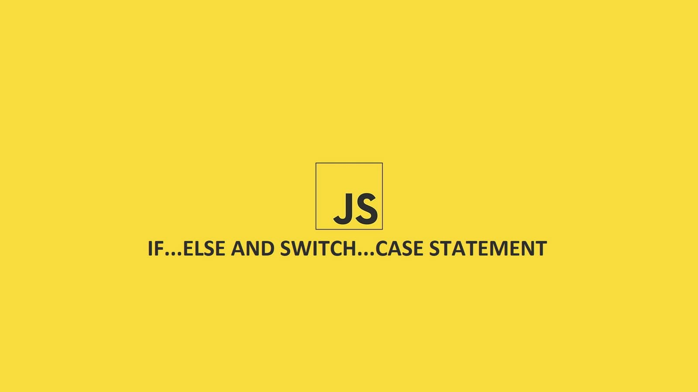
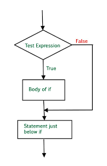
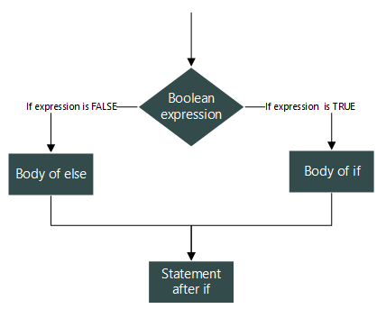
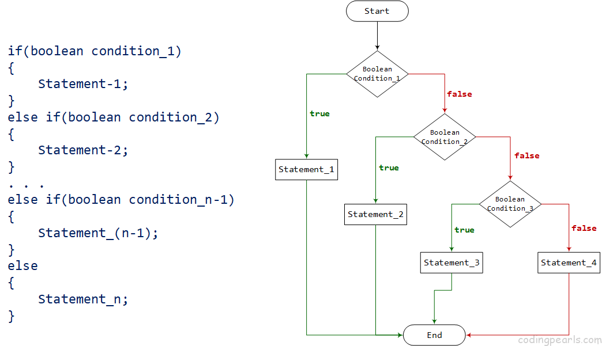
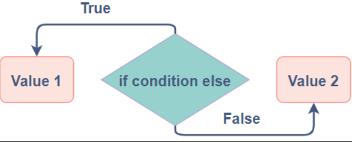
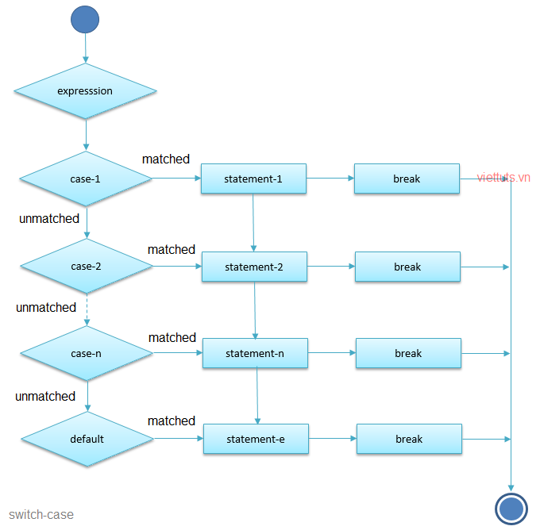

Câu lệnh điều kiện (conditional statements) giúp chương trình đưa ra quyết định, thực thi các nhánh code khác nhau dựa trên điều kiện đúng (`true`) hoặc sai (`false`). Bài viết này trình bày các loại câu lệnh điều kiện trong JavaScript, bao gồm ### Cú pháp, ví dụ minh họa, và sơ đồ luồng.



## 1. Câu lệnh có điều kiện là gì?

Câu lệnh điều kiện cho phép chương trình quyết định thực thi đoạn code nào dựa trên giá trị `true` hoặc `false` của biểu thức điều kiện.

- Nếu biểu thức trả về `true`: Thực thi đoạn code trong khối điều kiện.
- Nếu biểu thức trả về `false`: Bỏ qua hoặc thực thi nhánh khác (nếu có).

### Ví dụ

```javascript
let age = 20;
if (age >= 18) {
  console.log("Bạn đã đủ tuổi trưởng thành.");
}
```

**Kết quả:**

```
Bạn đã đủ tuổi trưởng thành.
```

**Sơ đồ luồng (flowchart):**

```
    [Bắt đầu]
       |
    [age >= 18?]____________
       |                    |
     True                  False
       |                    |
[In: "Bạn đã...]_______[Kết thúc]
```

## 2. Boolean, Truthy và Falsy

Trong JavaScript, mọi giá trị đều được ép kiểu về `true` hoặc `false` khi đánh giá trong điều kiện.

- **Falsy** (sai): `false`, `0`, `""` (chuỗi rỗng), `null`, `undefined`, `NaN`.
- **Truthy** (đúng): Tất cả các giá trị khác, ví dụ: `"hello"`, `123`, `[]`, `{}`.

### Ví dụ

```javascript
if ("hello") {
  console.log("Chuỗi không rỗng → truthy → in ra");
}
if (0) {
  console.log("Không chạy vì 0 là falsy");
}
```

**Kết quả:**

```
Chuỗi không rỗng → truthy → in ra
```

## 3. Câu lệnh `if`



Thực thi khối code nếu điều kiện trả về `true`.

### Cú pháp

```javascript
if (điều_kiện) {
  // Code thực thi nếu điều_kiện == true
}
```

### Ví dụ

```javascript
let temperature = 35;
if (temperature > 30) {
  console.log("Trời nóng, nhớ uống nhiều nước!");
}
```

**Kết quả:**

```
Trời nóng, nhớ uống nhiều nước!
```

**Sơ đồ luồng:**

```
   [Bắt đầu]
       |
[temperature > 30?]______________
       |                         |
      True                     False
       |                         |
[In: "Trời nóng..."]_________[Kết thúc]
```

## 4. Câu lệnh `if ... else`



Thực thi một khối code nếu điều kiện `true`, hoặc khối khác nếu `false`.

### Cú pháp

```javascript
if (điều_kiện) {
  // Code thực thi nếu điều_kiện == true
} else {
  // Code thực thi nếu điều_kiện == false
}
```

### Ví dụ

```javascript
let hour = 10;
if (hour < 12) {
  console.log("Chào buổi sáng!");
} else {
  console.log("Chào buổi chiều!");
}
```

**Kết quả:**

```
Chào buổi sáng!
```

**Sơ đồ luồng:**

```
   [Bắt đầu]
       |
   [hour < 12?] _____________________
        |                            |
      True                          False
        |                            |
[In: "Chào buổi sáng!"] [In: "Chào buổi chiều!"]
        |                            |
        |____________[Kết thúc]______|
```

## 5. Câu lệnh `if ... else if`



Dùng khi cần kiểm tra nhiều điều kiện liên tiếp.

### Cú pháp

```javascript
if (điều_kiện_1) {
  // Code thực thi nếu điều_kiện_1 == true
} else if (điều_kiện_2) {
  // Code thực thi nếu điều_kiện_2 == true
} else {
  // Code thực thi nếu tất cả điều kiện đều false
}
```

### Ví dụ

```javascript
let score = 85;
if (score >= 90) {
  console.log("Xuất sắc");
} else if (score >= 75) {
  console.log("Khá");
} else if (score >= 50) {
  console.log("Trung bình");
} else {
  console.log("Yếu");
}
```

**Kết quả:**

```
Khá
```

**Sơ đồ luồng:**

```
[Bắt đầu]
    |
  [score >= 90?]____
    |               |
   True           False
    |               |
[In: "Xuất sắc"] [score >= 75?]____
    |               |              |
    |             True           False
    |               |              |
    |        [In: "Khá"]   [score >= 50?]___________
    |              |               |                |
    |              |              True            False
    |              |               |                |
    |              |      [In: "Trung bình"]      [In: "Yếu"]
    |              |               |                |
    |______________|____________[Kết thúc]__________|
```

## 6. Toán tử ba ngôi


Toán tử ba ngôi (`?:`) là cách viết ngắn gọn cho `if ... else`.

### Cú pháp

```javascript
điều_kiện ? giá_trị_nếu_true : giá_trị_nếu_false;
```

### Ví dụ

```javascript
let age = 17;
let message = age >= 18 ? "Được phép lái xe" : "Chưa đủ tuổi lái xe";
console.log(message);
```

**Kết quả:**

```
Chưa đủ tuổi lái xe
```

**Sơ đồ luồng:**

```
   [Bắt đầu]
       |
   [age >= 18?]________________
       |                       |
      True                    False
       |                       |
[message = "Được phép..."] [message = "Chưa đủ..."]
       |                       |
    [In: message]______________|
       |
    [Kết thúc]
```

## 7. Câu lệnh `switch ... case`



Dùng để kiểm tra một biến với nhiều giá trị cụ thể, gọn gàng hơn khi có nhiều nhánh.

### Cú pháp

```javascript
switch (biểu_thức) {
  case giá_trị_1:
    // Code thực thi nếu biểu_thức == giá_trị_1
    break;
  case giá_trị_2:
    // Code thực thi nếu biểu_thức == giá_trị_2
    break;
  default:
  // Code thực thi nếu không khớp giá trị nào
}
```

### Ví dụ

```javascript
let day = 3;
switch (day) {
  case 1:
    console.log("Thứ Hai");
    break;
  case 2:
    console.log("Thứ Ba");
    break;
  case 3:
    console.log("Thứ Tư");
    break;
  case 4:
    console.log("Thứ Năm");
    break;
  case 5:
    console.log("Thứ Sáu");
    break;
  default:
    console.log("Cuối tuần");
}
```

**Kết quả:**

```
Thứ Tư
```

**Sơ đồ luồng:**

```
    [Bắt đầu]
       |
    [day = ?]____________________________
     |           |         |     ......  |
     1           2         3           default
     |                     |             |
[In: "Thứ Hai"]    [In: "Thứ Tư"]    [In: "Cuối tuần"]
     |                   |             |
   [break]____________[break]______[Kết thúc]
```

**Chú ý:** Nếu thiếu `break`, chương trình sẽ tiếp tục thực thi các `case` tiếp theo (hiện tượng _fall-through_).

## 8. So sánh `if ... else if` và `switch ... case`

| **Tiêu chí**    | **if ... else if**                  | **switch ... case**                        |
| --------------- | ----------------------------------- | ------------------------------------------ |
| **Điều kiện**   | So sánh phức tạp (>, <, >=, ...)    | So sánh giá trị rời rạc (===)              |
| **Độ dài code** | Có thể dài, khó đọc nếu nhiều nhánh | Gọn gàng khi kiểm tra nhiều giá trị cụ thể |
| **Hiệu suất**   | Tương đương (JS engine tối ưu tốt)  | Không khác biệt đáng kể                    |
