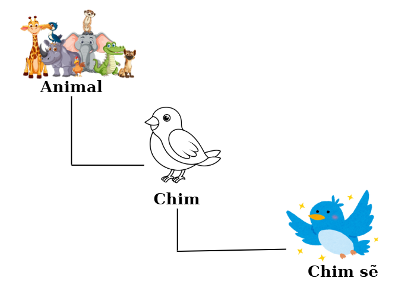

Lớp (class) trong JavaScript giống như một **bản thiết kế xe hơi** trong nhà máy: bạn vẽ chi tiết cách lắp ráp (cấu trúc), rồi sản xuất nhiều chiếc xe giống nhau (đối tượng), mỗi chiếc có thể tùy chỉnh (như màu sắc). Tôi sẽ giải thích như kể chuyện cho một người bạn chưa từng học lập trình, dùng nhiều hình ảnh đời thường, ví dụ code cụ thể, bảng so sánh, và flowchart để minh họa. Chúng ta sẽ đi chậm rãi, chia nhỏ thành nhiều phần con, để bạn nắm chắc từng khái niệm. JavaScript vốn dựa trên prototype (mẫu gốc), nhưng class là cách viết hiện đại, dễ hiểu hơn, giống lập trình hướng đối tượng (OOP) cổ điển.

---

## 1. Lớp là gì? (Định nghĩa cơ bản và lịch sử ngắn gọn)

Lớp giống như một **công thức làm bánh kem** trong sách nấu ăn. Công thức chỉ dẫn nguyên liệu (thuộc tính) và cách làm (phương thức). Bạn dùng công thức để làm nhiều cái bánh (đối tượng), mỗi cái có thể thêm topping riêng (tùy chỉnh).


**Giải thích đơn giản**:

- Lớp là một **mẫu thiết kế** để tạo nhiều đối tượng có cấu trúc tương tự.
- Đối tượng tạo từ lớp gọi là **instance** (bản sao cụ thể).
- Lịch sử: Trước ES6 (2015), JS dùng prototype để mô phỏng lớp. Class là "đường giả" (syntactic sugar) để viết dễ hơn, nhưng bên dưới vẫn là prototype.
- Phương pháp dựa trên lớp: Tập trung vào lớp làm trung tâm, hỗ trợ kế thừa, đóng gói, đa hình (polymorphism).

### 1.1. So sánh với đối tượng đơn lẻ

Đối tượng đơn lẻ là một "cái bánh làm tay", lớp là "công thức cho nhiều bánh".

**Ví dụ code**:

```javascript
// Đối tượng đơn lẻ (không lớp)
let xe1 = {
  mauSac: "đỏ",
  chay: function () {
    console.log("Xe đỏ chạy!");
  },
};

// Lớp (cho nhiều xe)
class XeHoi {
  constructor(mauSac) {
    this.mauSac = mauSac;
  }
  chay() {
    console.log(`Xe ${this.mauSac} chạy!`);
  }
}
let xe2 = new XeHoi("xanh");
xe2.chay(); // In: Xe xanh chạy!
```

### 1.2. Lớp trong ngữ cảnh OOP

Trong OOP, lớp là nền tảng cho 4 trụ cột: đóng gói (encapsulation - ẩn dữ liệu), kế thừa (inheritance), đa hình (polymorphism - phương thức khác nhau), trừu tượng (abstraction - ẩn chi tiết).

**Minh họa**: Flowchart cơ bản lớp.

```
[ Bản thiết kế: class XeHoi ]
  |
  |--> Constructor: khởi tạo thuộc tính (mauSac)
  |--> Phương thức: chay() (hành vi)
  |
  v
[ Instance: new XeHoi("đỏ") ] --> { mauSac: "đỏ", chay: function }
```

---

## 2. Tại sao sử dụng lớp? (Lợi ích chi tiết)

Thay vì lắp ráp xe thủ công mỗi lần (dễ lỗi, mất thời gian), bạn dùng bản thiết kế để sản xuất hàng loạt, dễ sửa (chỉ sửa thiết kế).

**Giải thích đơn giản**:

- **Tái sử dụng code**: Tạo nhiều instance từ một lớp.
- **Dễ bảo trì**: Sửa phương thức ở lớp, tất cả instance cập nhật.
- **Tổ chức tốt**: Nhóm dữ liệu và hành vi liên quan.
- **Kế thừa**: Mở rộng lớp mà không lặp code.
- **Đóng gói**: Ẩn dữ liệu private, chỉ lộ phương thức.

### 2.1. Ví dụ thực tế trong ứng dụng web/game

- **Web**: Lớp "User" với thuộc tính email, password; phương thức login, logout.
- **Game**: Lớp "Enemy" với thuộc tính máu, tốc độ; phương thức tấn công, di chuyển.

**Ví dụ code (ứng dụng web)**:

```javascript
class User {
  constructor(email, password) {
    this.email = email;
    this.#password = password; // Private
  }
  login() {
    console.log(`${this.email} đã đăng nhập.`);
  }
}
let user1 = new User("teo@example.com", "123456");
user1.login(); // In: teo@example.com đã đăng nhập.
```

### 2.2. Bảng so sánh không lớp vs có lớp

| Tiêu chí    | Không lớp (object literal/prototype thủ công) | Có lớp (class syntax) |
| ----------- | --------------------------------------------- | --------------------- |
| Tái sử dụng | Phải copy code thủ công                       | Tạo instance dễ dàng  |
| Kế thừa     | Cài đặt prototype phức tạp                    | Dùng extends đơn giản |
| Đọc code    | Dài dòng, dễ rối                              | Ngắn gọn, rõ ràng     |
| Bảo trì     | Sửa nhiều chỗ                                 | Sửa một chỗ (lớp)     |
| Ví dụ       | function + prototype                          | class + constructor   |

---

## 3. Khai báo lớp cơ bản

Viết bản thiết kế: bắt đầu bằng "class TenLop { }", bên trong là chi tiết.

**Giải thích đơn giản**:

- Tên lớp: Viết hoa chữ cái đầu (convention).
- Nội dung: Constructor, thuộc tính, phương thức.
- Khai báo: Có thể trong file riêng, export/import.

### 3.1. Cú pháp chi tiết

```javascript
class TenLop {
  // Constructor
  constructor() {
    /* Khởi tạo */
  }
  // Phương thức
  tenPhuongThuc() {
    /* Hành vi */
  }
}
```

### 3.2. Hoisting và lưu ý

Lớp không hoisted đầy đủ: phải khai báo trước khi dùng.
**Ví dụ lỗi**:

```javascript
let hs = new HocSinh(); // Lỗi: HocSinh chưa khai báo
class HocSinh {} // phải khai báo class trước mới sử dụng
```

---

## 4. Constructor (hàm tạo) chi tiết

Constructor giống "lắp khung xe" đầu tiên trong nhà máy: đặt màu, động cơ ban đầu.

**Giải thích đơn giản**:

- Chạy tự động khi `new`.
- Nhận tham số để tùy chỉnh instance.
- Không return (tự return instance).

### 4.1. Vai trò và cách dùng

Khởi tạo thuộc tính, kiểm tra dữ liệu.

### 4.2. Ví dụ với tham số mặc định

```javascript
class XeHoi {
  constructor(mauSac = "trắng", tocDo = 100) {
    this.mauSac = mauSac;
    this.tocDo = tocDo;
  }
}
let xe = new XeHoi(); // mauSac: trắng, tocDo: 100
console.log(xe.mauSac); // In: trắng
```

### 4.3. Lỗi thường gặp trong constructor

- Quên `this`: `ten = ten` thay vì `this.ten = ten` (biến cục bộ).
- Không gọi `super()` trong lớp con.

```javascript
class XeHoi extends Xe {
  constructor(ten, mau, tocDo = 100) {
    super(ten, mau); // Phải gọi constructor lớp cha bằng super()
    this.tocDo = tocDo;
  }

  thongTin() {
    console.log(
      `Tên: ${this.ten}, Màu: ${this.mau}, Tốc độ: ${this.tocDo} km/h`
    );
  }
}
```

**Cách tránh**: Luôn dùng `this` cho thuộc tính instance.

---

## 5. Thuộc tính (properties) trong lớp

Thuộc tính giống "bộ phận xe": bánh xe (chung), màu sơn (riêng từng xe).

**Giải thích đơn giản**:

- Instance properties: Riêng từng instance, gán **_trong_ constructor**.
- Class properties: Chung cho lớp, gán **_ngoài_ constructor**.

### 5.1. Instance properties

Gán với `this`.

### 5.2. Class properties

Gán trực tiếp trong lớp (ES2022+).

**Ví dụ code**:

```javascript
class XeHoi {
  soBanhXe = 4; // Class property (chung)
  constructor(mauSac) {
    this.mauSac = mauSac; // Instance property
  }
}
let xe1 = new XeHoi("đỏ");
let xe2 = new XeHoi("xanh");
console.log(xe1.soBanhXe); // In: 4
console.log(xe2.soBanhXe); // In: 4
```

### 5.3. Bảng so sánh thuộc tính instance vs class

| Loại     | Vị trí gán        | Phạm vi             | Ví dụ        |
| -------- | ----------------- | ------------------- | ------------ |
| Instance | Trong constructor | Riêng từng instance | this.mauSac  |
| Class    | Ngoài constructor | Chung lớp           | soBanhXe = 4 |

---

## 6. Phương thức (methods) trong lớp

Phương thức giống "nút bấm trên xe": nhấn ga để chạy.

**Giải thích đơn giản**:

- Phương thức là hàm định nghĩa hành vi.
- Chia sẻ qua prototype (tiết kiệm bộ nhớ).

### 6.1. Instance methods

Dùng `this` để truy cập thuộc tính.

### 6.2. Ví dụ minh họa với nhiều phương thức

```javascript
class HocSinh {
  constructor(ten, diem) {
    this.ten = ten;
    this.diem = diem;
  }
  hocBai() {
    console.log(`${this.ten} đang học.`);
  }
  tinhTrungBinh() {
    let sum = 0;
    for (let d of this.diem) sum += d;
    return sum / this.diem.length;
  }
}
let hs = new HocSinh("Tèo", [8, 9, 7]);
hs.hocBai(); // In: Tèo đang học.
console.log(hs.tinhTrungBinh()); // In: 8
```

### 6.3. Sử dụng `this` chi tiết

`this` trỏ đến instance hiện tại. Mất `this` nếu dùng arrow function trong phương thức (tránh).

---

## 7. Kế thừa (inheritance) với `extends` và `super`

Kế thừa giống xe điện (con) thừa hưởng khung xe từ xe hơi (cha), thêm pin điện.

**Giải thích đơn giản**:

- Kế thừa: Lớp con dùng thuộc tính/phương thức của cha.
- `extends`: Kết nối con với cha.
- `super`: Gọi cha (constructor hoặc phương thức).

### 7.1. Khái niệm kế thừa

Giảm lặp code, tạo hệ thống phân cấp.

### 7.2. Cách dùng `extends`

class Con extends Cha { }

```javascript
class XeDien extends XeHoi {
  constructor(ten, tocDo, pin) {
    super(ten, tocDo); // Gọi constructor lớp cha
    this.pin = pin; // Thuộc tính riêng của lớp con
  }
}
```

### 7.3. Sử dụng `super` cho constructor và phương thức

`super()` phải gọi trước `this` trong con.

```javascript
constructor(ten, tocDo, pin) {
    super(ten, tocDo); // Gọi constructor lớp cha
    this.pin = pin; // Thuộc tính riêng của lớp con
  }
```

### 7.4. Override (ghi đè) phương thức

Con có thể thay đổi phương thức cha.

```javascript
class XeHoi {
  constructor(ten, tocDo) {
    this.ten = ten;
    this.tocDo = tocDo;
  }

  chay() {
    console.log(`${this.ten} đang chạy ở tốc độ ${this.tocDo} km/h.`);
  }
}

class XeDien extends XeHoi {
  constructor(ten, tocDo, pin) {
    super(ten, tocDo); // Gọi constructor lớp cha
    this.pin = pin; // Thuộc tính riêng của lớp con
  }

  // Ghi đè (override) phương thức chay()
  chay() {
    console.log(
      `${this.ten} chạy êm ái ở tốc độ ${this.tocDo} km/h (điện, pin ${this.pin}%).`
    );
  }

  sacPin() {
    console.log(`${this.ten} đang sạc pin...`);
    this.pin = 100;
  }
}
```

### 7.5. Ví dụ đa cấp kế thừa



```javascript
class DongVat {
  constructor(ten) {
    this.ten = ten;
  }
  diChuyen() {
    console.log(`${this.ten} di chuyển.`);
  }
}

class Chim extends DongVat {
  bay() {
    console.log(`${this.ten} bay.`);
  }
}

class ChimSe extends Chim {
  constructor(ten) {
    super(ten);
  }
  diChuyen() {
    // Override
    super.bay(); // Gọi cha
    console.log(`${this.ten} bay thấp.`);
  }
}
let se = new ChimSe("Sẻ");
se.diChuyen(); // In: Sẻ bay. Sẻ bay thấp.
```

**Minh họa**: Flowchart kế thừa.

```
DongVat (cha)
  |
  |--> Chim (con)
        |
        |--> ChimSe (cháu)
              |
              v
Override: diChuyen() --> Gọi super.bay()
```

---

## 8. Static methods và properties (tĩnh)

Static giống "bảng hướng dẫn" ở nhà máy, dùng chung, không cần sản xuất xe mới.

**Giải thích đơn giản**:

- Static thuộc lớp, không thuộc instance.
- Gọi: TenLop.tenStatic().

### 8.1. Định nghĩa và vai trò

Dùng cho tiện ích chung, không phụ thuộc instance.

### 8.2. Ví dụ static methods

```javascript
class ToanHoc {
  static cong(a, b) {
    return a + b;
  }
}
console.log(ToanHoc.cong(5, 3)); // In: 8
```

### 8.3. Ví dụ static properties

```javascript
class Dem {
  static soLan = 0;
  constructor() {
    Dem.soLan++;
  }
}
new Dem();
new Dem();
console.log(Dem.soLan); // In: 2
```

### 8.4. Lỗi thường gặp với static

- Gọi static từ instance: hs.staticMethod() - lỗi.
- Cách tránh: Luôn gọi từ tên lớp.

```javascript
class HocSinh {
  constructor(ten) {
    this.ten = ten;
  }

  static chao() {
    console.log("Xin chào! Tôi là học sinh.");
  }
}

let hs = new HocSinh("Minh");

// Sai: gọi static qua instance
hs.chao();
// Lỗi: TypeError: hs.chao is not a function

//  Đúng: gọi static qua tên lớp
HocSinh.chao();
// → Xin chào! Tôi là học sinh.
```

---

## 9. Private fields và methods (riêng tư)

Private giống "két sắt" trong nhà, chỉ chủ nhà mở được.

**Giải thích đơn giản**:

- Private: Không truy cập từ ngoài lớp.
- Dùng `#` trước tên.

### 9.1. Tại sao cần private?

Bảo vệ dữ liệu, tránh sửa nhầm.

### 9.2. Cú pháp với `#`

```javascript
class TaiKhoan {
  #soDu = 0;
  nap(soTien) {
    this.#soDu += soTien;
  }
}
```

### 9.3. Private methods

```javascript
class MayTinh {
  #tinhBinhPhuong(n) {
    return n * n;
  }
  tinh(n) {
    return this.#tinhBinhPhuong(n);
  }
}
let mt = new MayTinh();
console.log(mt.tinh(5)); // In: 25
// mt.#tinhBinhPhuong(5); // Lỗi
```

### 9.4. So sánh với convention cũ (\_underscore)

- Cũ: \_soDu (không thật sự ẩn, chỉ convention).
- Mới: #soDu (thật sự ẩn, lỗi nếu truy cập).

**Bảng so sánh**:
| Phương pháp | Mức độ ẩn | Cú pháp | Ví dụ |
|---------------|-----------|-------------|----------------|
| Convention | Không thật | \_ten | \_soDu = 0 |
| Private | Thật | #ten | #soDu = 0 |

---

## 10. Getter và Setter (truy cập kiểm soát)

Getter giống "cửa kính" xem đồ trong két sắt mà không mở. Setter giống "khe nạp tiền" với kiểm tra (chỉ nạp tiền thật).

**Giải thích đơn giản**:

- Getter: Lấy giá trị như thuộc tính, nhưng chạy code (tính toán).
- Setter: Đặt giá trị với kiểm tra (validation).

### 10.1. Getter: Lấy giá trị an toàn

```javascript
class HinhTron {
  constructor(banKinh) {
    this.banKinh = banKinh;
  }
  get dienTich() {
    return Math.PI * this.banKinh ** 2;
  }
}
let ht = new HinhTron(5);
console.log(ht.dienTich); // In: ~78.54 (không cần ())
```

### 10.2. Setter: Đặt giá trị với validation

```javascript
class Nguoi {
  constructor(tuoi) {
    this._tuoi = tuoi;
  }
  set tuoi(giaTri) {
    if (giaTri >= 0 && giaTri <= 120) this._tuoi = giaTri;
    else console.log("Tuổi không hợp lệ!");
  }
}
let ng = new Nguoi(20);
ng.tuoi = 25; // OK
ng.tuoi = -5; // In: Tuổi không hợp lệ!
```

### 10.3. Ví dụ kết hợp getter/setter với private

```javascript
class NganHang {
  #soDu = 0;
  get soDu() {
    return this.#soDu;
  }
  set soDu(soTien) {
    if (soTien >= 0) this.#soDu = soTien;
  }
}
let tk = new NganHang();
tk.soDu = 1000;
console.log(tk.soDu); // In: 1000
```

### 10.4. Lợi ích trong thực tế

- Kiểm soát dữ liệu (validation).
- Tính toán lazy (chỉ tính khi cần).

---

## 11. So sánh với phương pháp prototype-based (cũ)

Prototype giống "mẫu thủ công" từ giấy, class giống "mẫu in 3D" hiện đại.

**Giải thích đơn giản**:

- JS là prototype-based: Mọi đối tượng có **proto** trỏ đến prototype.
- Class: Cách viết đẹp cho prototype, tự động thiết lập.

### 11.1. Prototype là gì?

Bản mẫu chia sẻ phương thức.

### 11.2. Cách viết prototype thủ công

```javascript
// Tạo hàm khởi tạo (constructor)
function XeHoi(ten) {
  this.ten = ten;
}

// Gắn phương thức vào prototype
XeHoi.prototype.chay = function () {
  console.log(`${this.ten} đang chạy...`);
};

let xe1 = new XeHoi("Toyota");
let xe2 = new XeHoi("Honda");

xe1.chay(); // → Toyota đang chạy...
xe2.chay(); // → Honda đang chạy...

// Kiểm tra nguyên mẫu
console.log(Object.getPrototypeOf(xe1) === XeHoi.prototype); // true
```

### 11.3. Bảng so sánh class vs prototype

| Tiêu chí | Prototype thủ công | Class syntax |
| -------- | ------------------ | ------------ |
| Cú pháp  | Dài, phức tạp      | Ngắn, dễ đọc |
| Kế thừa  | Object.create      | extends      |
| Static   | XeHoi.ten = ...    | static ten() |
| Private  | Không hỗ trợ       | #ten         |

### 11.4. Class hoạt động bên dưới như thế nào?

Class tự động gán phương thức vào prototype.
**Ví dụ**: HocSinh.prototype.gioiThieu = function...

---

## 12. Các khái niệm nâng cao

### 12.1. Computed property names

Tên thuộc tính động.

```javascript
let prop = "ten";
class Nguoi {
  [prop] = "Tèo";
}
let ng = new Nguoi();
console.log(ng.ten); // In: Tèo
```

### 12.2. Class expressions

Gán lớp vào biến.

```javascript
let Lop = class {
  sayHi() {
    console.log("Hi");
  }
};
let l = new Lop();
l.sayHi(); // In: Hi
```

### 12.3. Kiểm tra instanceof

Kiểm tra instance thuộc lớp nào.

```javascript
class HocSinh {}
let hs = new HocSinh();
console.log(hs instanceof HocSinh); // true
```

---

## 13. Lỗi thường gặp và cách tránh

**Hình ảnh đời thường**: Lỗi giống như xây nhà quên móng, sụp đổ.

### 13.1. Lỗi quên `new`

`HocSinh()` - lỗi, phải `new HocSinh()`.

### 13.2. Lỗi `this` không đúng ngữ cảnh

Trong callback, `this` mất. Cách tránh: Dùng arrow function hoặc bind.

**Ví dụ**:

```javascript
class Xe {
  constructor() {
    this.mau = "đỏ";
  }
  inMau() {
    console.log(this.mau);
  }
}
let x = new Xe();
let btn = { click: x.inMau };
btn.click(); // undefined (mất this)
```

Cách sửa: `click: () => console.log(this.mau)`.

### 13.3. Vấn đề với kế thừa sâu

Kế thừa nhiều lớp: khó debug. Cách tránh: Giới hạn 2-3 cấp, ưu tiên composition.

---

## 14. Ứng dụng thực tế và ví dụ lớn

### 14.1. Xây dựng lớp cho game đơn giản

Lớp "Player" và "Enemy" kế thừa "Character".

**Ví dụ code đầy đủ**:

```javascript
class Character {
  constructor(ten, mau) {
    this.ten = ten;
    this.mau = mau;
  }
  tanCong(damage) {
    this.mau -= damage;
    console.log(`${this.ten} mất ${damage} máu, còn ${this.mau}`);
  }
}

class Player extends Character {
  constructor(ten, mau, vuKhi) {
    super(ten, mau);
    this.vuKhi = vuKhi;
  }
  suDungVuKhi() {
    console.log(`${this.ten} dùng ${this.vuKhi}`);
  }
}

class Enemy extends Character {
  constructor(ten, mau, tocDo) {
    super(ten, mau);
    this.tocDo = tocDo;
  }
  chay() {
    console.log(`${this.ten} chạy với tốc độ ${this.tocDo}`);
  }
}

let player = new Player("Hero", 100, "kiếm");
let enemy = new Enemy("Quái vật", 50, 20);
player.suDungVuKhi(); // In: Hero dùng kiếm
enemy.tanCong(30); // In: Quái vật mất 30 máu, còn 20
```

### 14.2. Lớp trong ứng dụng web (form validation)

Lớp "FormValidator" kiểm tra input.

**Ví dụ code**:

```javascript
class FormValidator {
  constructor(formId) {
    this.form = document.getElementById(formId);
  }
  validateEmail(email) {
    return /\S+@\S+\.\S+/.test(email);
  }
  submit() {
    let email = this.form.email.value;
    if (this.validateEmail(email)) {
      console.log("Form hợp lệ!");
    } else {
      console.log("Email không hợp lệ!");
    }
  }
}
// Giả sử HTML có <form id="myForm"><input name="email"></form>
let validator = new FormValidator("myForm");
validator.submit();
```

---

## 15. Kết luận và mẹo sử dụng

- **Tóm tắt**: Lớp giúp xây dựng code có cấu trúc, dễ mở rộng với kế thừa, private, static, getter/setter.
- **Mẹo**:
  - Bắt đầu bằng constructor đơn giản, thêm phương thức sau.
  - Sử dụng ESLint để check lỗi `this`.
  - Kết hợp với modules (export class) cho dự án lớn.
  - Học thêm TypeScript để class mạnh mẽ hơn (type checking).
  - Thực hành: Tạo lớp cho dự án cá nhân như todo list (lớp Task).

**Flowchart chi tiết**:

```
[ Lớp Cha: DongVat ]
  |--> Constructor(ten) { this.ten = ten }
  |--> Phương thức: an() { ... }
  |--> Static: demDongVat() { ... }
  |
  v
[ Kế thừa: class Cho extends DongVat ]
  |--> super(ten)
  |--> #giong (private)
  |--> Phương thức: sua() { ... }
  |--> Getter: getGiong() { return this.#giong }
  |--> Setter: setGiong(g) { this.#giong = g }
  |
  v
[ Instance: new Cho("Buddy") ] --> { ten: "Buddy", #giong: ... }
                                   |--> Gọi: cho.sua()
                                   |--> Kiểm tra: cho instanceof DongVat (true)
```

---

## 16. Tài liệu tham khảo

- [MDN Web Docs: Classes](https://developer.mozilla.org/en-US/docs/Web/JavaScript/Reference/Classes)
- [JavaScript.info: Class Inheritance](https://javascript.info/class-inheritance)
- [Eloquent JavaScript: The Secret Life of Objects](https://eloquentjavascript.net/06_object.html)
- [TypeScript Handbook: Classes](https://www.typescriptlang.org/docs/handbook/classes.html) (cho nâng cao)
