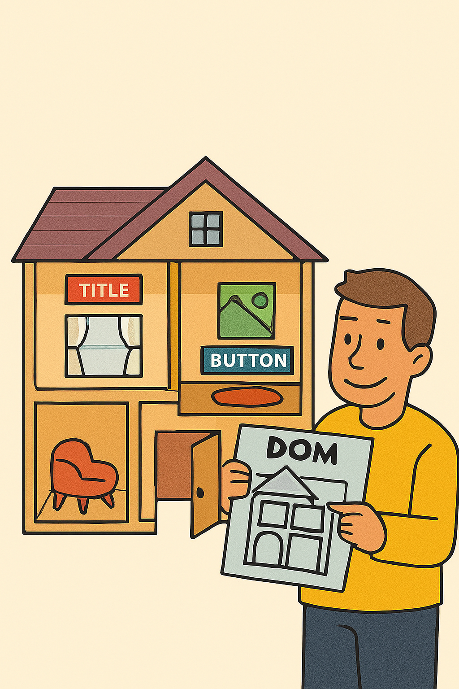
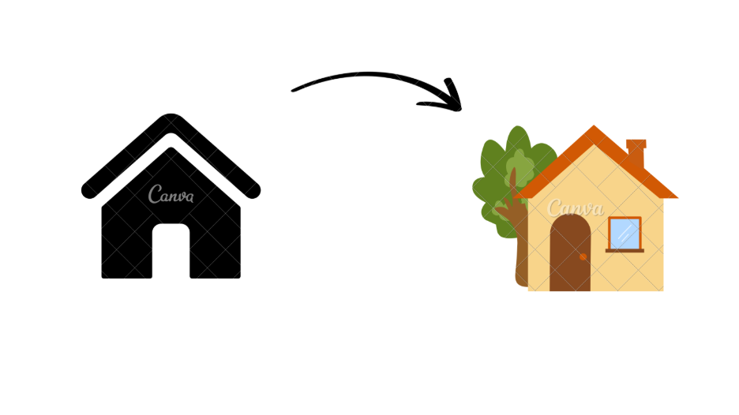

DOM (Document Object Model) trong JavaScript giống như một **bản đồ ngôi nhà** của trang web: nó biểu diễn mọi thứ trên trang (nút bấm, tiêu đề, hình ảnh) như các phòng, và bạn có thể vào từng phòng để xem, sửa, hoặc thêm đồ đạc.

---

---

## 1. DOM là gì?

Hãy nghĩ trang web như một **ngôi nhà**, với các phòng là tiêu đề, hình ảnh, nút bấm. DOM là **bản đồ ngôi nhà**, giúp bạn tìm phòng (phần tử HTML), xem đồ đạc (nội dung), sửa đổi (thay màu tường), hoặc thêm phòng mới.



**Giải thích đơn giản**:

- DOM (Document Object Model) là cách trình duyệt biểu diễn trang web thành một **cây đối tượng** mà JavaScript có thể tương tác.
- Mỗi thẻ HTML (như `<div>`, `<p>`) là một **nút** (node) trong cây.
- JavaScript dùng DOM để đọc, sửa, thêm, xóa phần tử trên trang.

### 1.1. So sánh DOM với trang web thật

- **Trang web thật**: Bạn thấy giao diện (văn bản, ảnh) trên trình duyệt.
- **DOM**: Bản đồ ẩn mà trình duyệt tạo, chứa mọi thẻ HTML dưới dạng đối tượng.

**Ví dụ HTML**:

```html
<!DOCTYPE html>
<html>
  <body>
    <h1 id="title">Xin chào</h1>
    <p class="text">Đây là đoạn văn.</p>
  </body>
</html>
```

**DOM biểu diễn** (cây đối tượng):

```
document
  └── html
       ├── head
       └── body
            ├── h1#title ("Xin chào")
            └── p.text ("Đây là đoạn văn.")
```

### 1.2. Cấu trúc cây DOM

- **Root**: `document` là gốc.
- **Nodes**:
  - **Element nodes**: Thẻ HTML (`<div>`, `<p>`).
  - **Text nodes**: Văn bản bên trong thẻ.
  - **Attribute nodes**: Thuộc tính (như `id`, `class`).

**Minh họa**: Flowchart cây DOM.

```
[ document ]
  |
  └── [ html ]
        |
        ├── [ head ]
        └── [ body ]
              |
              ├── [ h1#title ] --> "Xin chào"
              └── [ p.text ] --> "Đây là đoạn văn."
```

---

## 2. Tại sao cần DOM?

Bạn muốn thay đổi màu tường hoặc thêm ghế trong nhà. DOM giống như công cụ cho phép bạn sửa đổi ngôi nhà mà không cần xây lại.



**Giải thích đơn giản**:

- **Tương tác động**: Thay đổi nội dung, style, hoặc thêm phần tử mà không tải lại trang.
- **Xử lý sự kiện**: Phản hồi khi người dùng click, nhập text, di chuột.
- **Tùy chỉnh giao diện**: Tạo web động (như hiển thị danh sách sản phẩm).

### 2.1. Lợi ích trong phát triển web

- **Tăng tính tương tác**: Form tự kiểm tra, nút bấm phản hồi.
- **Tái sử dụng**: Thêm/xóa phần tử (như thêm sản phẩm vào giỏ hàng).
- **Dễ bảo trì**: Thay đổi một chỗ, ảnh hưởng toàn trang.

### 2.2. Ví dụ thực tế (web động, game)

- **Web**: Thay đổi tiêu đề khi người dùng đăng nhập.
- **Game**: Di chuyển nhân vật khi nhấn phím.

**Ví dụ code** (thay đổi tiêu đề):

```js
document.getElementById("title").textContent = "Chào mừng bạn!";
```

---

## 3. Cách truy cập DOM

Để sửa phòng, bạn phải tìm đúng phòng trong bản đồ. Truy cập DOM là tìm đúng phần tử HTML để thao tác.

**Giải thích đơn giản**:

- `document` là điểm bắt đầu, như "cửa chính" của ngôi nhà.
- Dùng các phương thức để tìm phần tử theo id, class, tag, v.v.

### 3.1. `document` object

`document` là đối tượng toàn cục, đại diện toàn bộ trang web.

### 3.2. Các phương thức tìm phần tử

- `getElementById(id)`: Tìm một phần tử duy nhất theo id.
- `getElementsByClassName(class)`: Tìm danh sách phần tử theo class.
- `getElementsByTagName(tag)`: Tìm theo tên thẻ (như `div`, `p`).
- `querySelector(selector)`: Tìm phần tử đầu tiên khớp CSS selector.
- `querySelectorAll(selector)`: Tìm tất cả phần tử khớp selector.

**Ví dụ code** (HTML giả định):

```html
<div id="main">Chào bạn</div>
<p class="text">Đoạn văn 1</p>
<p class="text">Đoạn văn 2</p>
```

```javascript
// Tìm theo id
let main = document.getElementById("main");
console.log(main.textContent); // In: Chào bạn

// Tìm theo class
let texts = document.getElementsByClassName("text");
console.log(texts[0].textContent); // In: Đoạn văn 1

// Tìm theo tag
let paragraphs = document.getElementsByTagName("p");
console.log(paragraphs.length); // In: 2

// querySelector
let firstText = document.querySelector(".text");
console.log(firstText.textContent); // In: Đoạn văn 1

// querySelectorAll
let allTexts = document.querySelectorAll(".text");
allTexts.forEach((p) => console.log(p.textContent)); // In: Đoạn văn 1, Đoạn văn 2
```

### 3.3. Bảng so sánh các phương thức tìm

| Phương thức              | Trả về         | Khi nào dùng?                  | Ví dụ              |
| ------------------------ | -------------- | ------------------------------ | ------------------ |
| `getElementById`         | 1 phần tử      | Tìm duy nhất bằng id           | `#main`            |
| `getElementsByClassName` | HTMLCollection | Tìm nhiều phần tử theo class   | `.text`            |
| `getElementsByTagName`   | HTMLCollection | Tìm theo tên thẻ               | `p`                |
| `querySelector`          | 1 phần tử      | Tìm đầu tiên bằng CSS selector | `.text`, `#main p` |
| `querySelectorAll`       | NodeList       | Tìm tất cả bằng CSS selector   | `.text`, `div > p` |

**Lưu ý**: HTMLCollection tự động cập nhật, NodeList thì không.

---

## 4. Thao tác với phần tử DOM

Khi tìm được phòng, bạn có thể sơn lại tường (style), thay đồ đạc (nội dung), hoặc thêm cửa mới (phần tử).

**Giải thích đơn giản**:

- Thay đổi nội dung (text/HTML).
- Sửa thuộc tính (như `src`, `class`).
- Thay đổi style (CSS).
- Thêm/xóa phần tử.

### 4.1. Truy cập nội dung (text, HTML)

- `textContent`: Lấy/gán văn bản thuần.
- `innerHTML`: Lấy/gán HTML bên trong.

**Ví dụ code**:

```html
<div id="main">Chào bạn</div>
```

```javascript
let div = document.getElementById("main");
div.textContent = "Xin chào thế giới!"; // Thay văn bản
div.innerHTML = "<strong>Xin chào</strong> thế giới!"; // Thêm HTML
```

### 4.2. Thay đổi thuộc tính (attribute)

- `getAttribute(name)`: Lấy giá trị thuộc tính.
- `setAttribute(name, value)`: Đặt giá trị.
- Truy cập trực tiếp: `element.id`, `element.className`.

**Ví dụ code**:

```html

```

```javascript
let img = document.getElementById("photo");
console.log(img.getAttribute("src")); // In: old.jpg
img.setAttribute("src", "new.jpg");
img.alt = "Ảnh mới"; // Truy cập trực tiếp
```

### 4.3. Thay đổi style (CSS)

- `style.tinhChat`: Thay đổi style inline (camelCase).
- `classList.add/remove/toggle`: Quản lý class.

**Ví dụ code**:

```html
<div id="box">Hộp</div>
```

```javascript
let box = document.getElementById("box");
box.style.backgroundColor = "blue"; // Thay màu nền
box.classList.add("highlight"); // Thêm class
box.classList.toggle("hidden"); // Bật/tắt class
```

### 4.4. Thêm/xóa phần tử

- `createElement(tag)`: Tạo phần tử mới.
- `appendChild(node)`: Thêm con.
- `removeChild(node)`: Xóa con.
- `remove()`: Xóa chính phần tử.

**Ví dụ code**:

```html
<ul id="list"></ul>
```

```javascript
let ul = document.getElementById("list");
let li = document.createElement("li");
li.textContent = "Mục mới";
ul.appendChild(li); // Thêm <li>Mục mới</li>
ul.removeChild(li); // Xóa
```

---

## 5. Xử lý sự kiện (Event Handling)

Sự kiện giống như khi bạn nhấn công tắc đèn (click), đèn sáng. DOM cho phép "lắng nghe" hành động người dùng.

**Giải thích đơn giản**:

- Sự kiện: Hành động như click, nhập text, di chuột,...
- Thêm bằng `addEventListener` hoặc thuộc tính `onclick`.

### 5.1. Sự kiện là gì?

Các hành động người dùng (click, keydown) hoặc trình duyệt (load).

### 5.2. Các cách thêm sự kiện

- `addEventListener(event, callback)`: Linh hoạt, thêm nhiều listener.
- `element.onclick = function()`: Gán trực tiếp, chỉ một listener.

### 5.3. Ví dụ: Click, input, mouseover

```html
<button id="btn">Nhấn tôi</button>
<input id="input" type="text" />
<div id="box">Di chuột qua</div>
```

```javascript
// Click
let btn = document.getElementById("btn");
btn.addEventListener("click", () => {
  alert("Bạn đã nhấn!");
});

// Input
let input = document.getElementById("input");
input.addEventListener("input", (e) => {
  console.log("Bạn nhập: " + e.target.value);
});

// Mouseover
let box = document.getElementById("box");
box.addEventListener("mouseover", () => {
  box.style.backgroundColor = "yellow";
});
```

---

## 6. Duyệt cây DOM (DOM Traversal)

Duyệt DOM giống như đi bộ trong nhà, từ phòng khách (cha) đến phòng ngủ (con), hoặc sang phòng bên (anh em).

**Giải thích đơn giản**:

- Di chuyển qua các node: cha (`parentNode`), con (`children`), anh em (`nextSibling`).

### 6.1. Di chuyển đến cha, con, anh em

- `parentNode`: Lên cha.
- `children`: Danh sách con.
- `firstElementChild`, `lastElementChild`: Con đầu/cuối.
- `nextElementSibling`, `previousElementSibling`: Anh em kế tiếp/trước.

### 6.2. Ví dụ duyệt cây DOM

```html
<div id="parent">
  <p>Đoạn 1</p>
  <p>Đoạn 2</p>
</div>
```

```javascript
let parent = document.getElementById("parent");
console.log(parent.firstElementChild.textContent); // In: Đoạn 1
console.log(parent.children[1].textContent); // In: Đoạn 2
console.log(parent.children[0].nextElementSibling.textContent); // In: Đoạn 2
```

**Minh họa**: Flowchart duyệt DOM.

```
[ div#parent ]
  |
  ├── [ p ] --> "Đoạn 1" (firstElementChild)
  └── [ p ] --> "Đoạn 2" (nextElementSibling)
```

---

## 7. DOM và hiệu suất

Nếu bạn sơn lại cả ngôi nhà mỗi lần muốn đổi màu một phòng, rất tốn công. Thao tác DOM nhiều lần làm chậm trang.

**Giải thích đơn giản**:

- DOM thao tác trực tiếp trình duyệt, tốn tài nguyên.
- Truy cập DOM nhiều lần hoặc cập nhật liên tục gây lag.

### 7.1. Lỗi làm chậm trang

- Lặp `innerHTML` trong vòng lặp lớn.
- Thêm từng phần tử riêng lẻ.

### 7.2. Cách tối ưu

- **DocumentFragment**: Tạo các node tạm, thêm một lần.
- **Cache DOM**: Lưu kết quả truy cập vào biến.
- **Batch update**: Cập nhật style một lần.

**Ví dụ code (tối ưu)**:

```javascript
// Không tối ưu
for (let i = 0; i < 1000; i++) {
  document.getElementById("list").innerHTML += "<li>Mục</li>";
}

// Tối ưu
let fragment = document.createDocumentFragment();
for (let i = 0; i < 1000; i++) {
  let li = document.createElement("li");
  li.textContent = "Mục";
  fragment.appendChild(li);
}
document.getElementById("list").appendChild(fragment);
```

---

## 8. DOM ảo (Virtual DOM) và so sánh

DOM thật giống sửa nhà trực tiếp (chậm). Virtual DOM giống như vẽ bản sửa đổi trên giấy, rồi áp dụng một lần (nhanh).

**Giải thích đơn giản**:

- **Virtual DOM**: Bản sao DOM trong bộ nhớ (React, Vue dùng).
- So sánh Virtual DOM với DOM thật, chỉ cập nhật thay đổi.

### 8.1. Virtual DOM là gì?

Bản sao nhẹ của DOM, tính toán thay đổi trước khi áp dụng.

### 8.2. So sánh với DOM thật

| Tiêu chí   | DOM thật                    | Virtual DOM          |
| ---------- | --------------------------- | -------------------- |
| Tốc độ     | Chậm (truy cập trình duyệt) | Nhanh (trong bộ nhớ) |
| Cập nhật   | Toàn bộ cây DOM             | Chỉ phần thay đổi    |
| Dùng trong | Vanilla JS                  | React, Vue           |

---

## 9. Ứng dụng thực tế

### 9.1. Xây dựng todo list động

**HTML**:

```html
<input id="input" type="text" />
<button id="add">Thêm</button>
<ul id="todoList"></ul>
```

**JavaScript**:

```javascript
let input = document.getElementById("input");
let addBtn = document.getElementById("add");
let list = document.getElementById("todoList");

addBtn.addEventListener("click", () => {
  let task = input.value;
  if (task) {
    let li = document.createElement("li");
    li.textContent = task;
    let delBtn = document.createElement("button");
    delBtn.textContent = "Xóa";
    delBtn.addEventListener("click", () => li.remove());
    li.appendChild(delBtn);
    list.appendChild(li);
    input.value = "";
  }
});
```

### 9.2. Tạo hiệu ứng hover

```html
<div id="box">Di chuột qua</div>
```

```javascript
let box = document.getElementById("box");
box.addEventListener("mouseover", () => {
  box.style.backgroundColor = "yellow";
});
box.addEventListener("mouseout", () => {
  box.style.backgroundColor = "";
});
```

### 9.3. Form validation

```html
<form id="form">
  <input type="email" id="email" />
  <button type="submit">Gửi</button>
</form>
```

```javascript
let form = document.getElementById("form");
let email = document.getElementById("email");

form.addEventListener("submit", (e) => {
  e.preventDefault();
  if (/^\S+@\S+\.\S+$/.test(email.value)) {
    console.log("Email hợp lệ!");
  } else {
    console.log("Email không hợp lệ!");
  }
});
```

---

## 10. Lỗi thường gặp và cách tránh

### 10.1. Lỗi truy cập phần tử không tồn tại

- **Lỗi**: `document.getElementById("id")` trả về null.
- **Cách tránh**: Kiểm tra trước khi dùng.

```javascript
let el = document.getElementById("id");
if (el) el.textContent = "OK";
```

### 10.2. Lỗi sự kiện lặp lại

- Thêm nhiều listener trùng lặp.
- **Cách tránh**: Dùng `removeEventListener` hoặc kiểm tra.

### 10.3. Lỗi hiệu suất

- Thao tác DOM trong vòng lặp lớn.
- **Cách tránh**: Dùng DocumentFragment, cache DOM.

---

## 11. Kết luận và mẹo sử dụng

- **Tóm tắt**: DOM là bản đồ trang web, giúp JavaScript tương tác động (đọc, sửa, thêm, xóa phần tử, xử lý sự kiện).
- **Mẹo**:
  - Dùng `querySelector` cho tìm kiếm linh hoạt.
  - Cache DOM vào biến để tăng tốc.
  - Sử dụng `addEventListener` thay vì `onclick`.
  - Thực hành: Tạo todo list, form, hoặc hiệu ứng động.
  - Học thêm thư viện (React, Vue) để hiểu Virtual DOM.

**Flowchart chi tiết**:

```
[ document ]
  |
  └── [ html ]
        |
        ├── [ head ]
        └── [ body ]
              |
              ├── [ div#main ] --> getElementById
              ├── [ p.text ] --> querySelectorAll
              └── [ button ] --> addEventListener(click)
                                    |
                                    v
                                    Thay đổi: textContent, style
                                    Thêm/xóa: appendChild, remove
```

---

## 12. Tài liệu tham khảo

- [MDN Web Docs: DOM](https://developer.mozilla.org/en-US/docs/Web/API/Document_Object_Model)
- [JavaScript.info: DOM](https://javascript.info/dom-nodes)
- [Eloquent JavaScript: The Document Object Model](https://eloquentjavascript.net/14_dom.html)
- [W3Schools: JavaScript DOM](https://www.w3schools.com/js/js_htmldom.asp)
