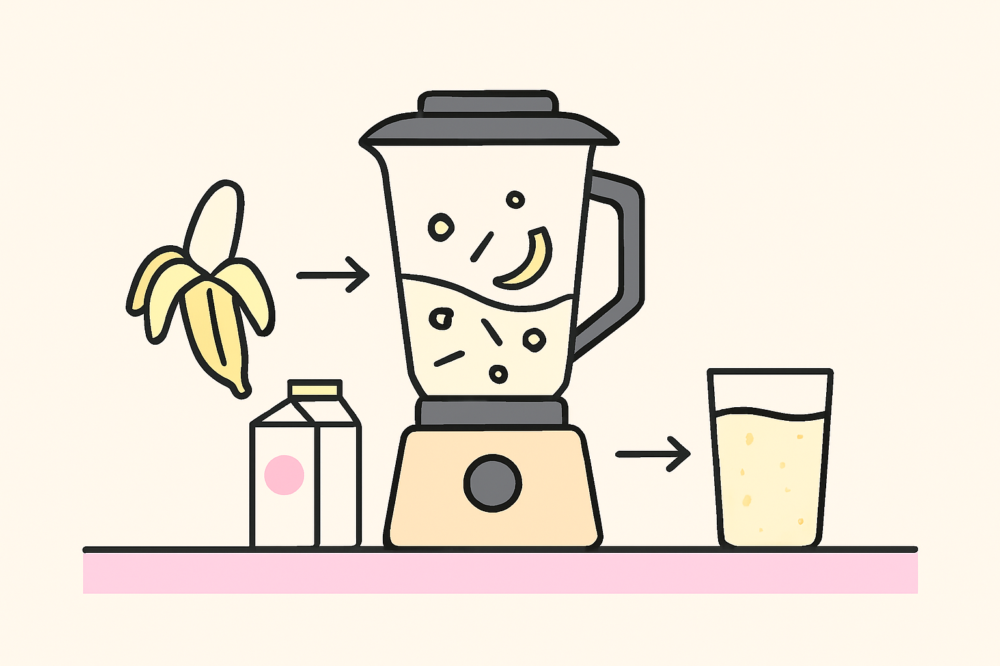

Hàm trong JavaScript giống như những **cỗ máy nhỏ** bạn tạo ra để làm một việc cụ thể, như tính toán, in lời chào, hoặc xử lý dữ liệu. Hãy tưởng tượng tôi đang kể chuyện cho một người bạn chưa biết gì về lập trình. Tôi sẽ dùng ví dụ đời thường, chia nhỏ từng khái niệm, và vẽ một bức tranh tổng thể để bạn dễ hình dung.

---

## 1. Hàm là gì?

Hãy nghĩ về hàm như một **máy xay sinh tố** trong bếp. Bạn bỏ nguyên liệu vào (như chuối, sữa), máy xay làm việc, và cho ra sinh tố. Hàm trong JavaScript cũng vậy: nó nhận **đầu vào** (nếu có), làm gì đó, và trả **đầu ra** (nếu cần).

**Giải thích đơn giản**:

- Hàm là một khối mã làm một việc cụ thể, như tính tổng hai số hoặc in "Xin chào".
- Bạn có thể **gọi lại** hàm nhiều lần, tiết kiệm thời gian thay vì viết lại mã.
- Hàm có thể có tên (như `tinhTong`) hoặc không tên (hàm ẩn danh, dùng một lần).

**Ví dụ đời thường**: Bạn có công thức làm bánh: trộn bột, đường, trứng, rồi nướng. Thay vì viết lại công thức mỗi lần làm bánh, bạn ghi vào sổ (hàm) và chỉ cần mở sổ ra làm theo.

**Ví dụ code**:

```javascript
function chaoHoi() {
  console.log("Xin chào!");
}
chaoHoi(); // In: Xin chào!
```

---

## 2. Tại sao sử dụng hàm?

Tưởng tượng bạn phải lau nhà 10 lần một ngày. Thay vì lấy chổi, xô, nước mỗi lần, bạn chuẩn bị một **bộ dụng cụ lau nhà** và chỉ cần lấy ra dùng. Hàm giống bộ dụng cụ: làm một lần, dùng nhiều lần.

**Giải thích đơn giản**:

- **Tiết kiệm công sức**: Không phải viết lại mã giống nhau (như tính tổng giỏ hàng ở nhiều nơi).
- **Dễ sửa**: Chỉ sửa một chỗ (hàm) thay vì tìm khắp chương trình.
- **Dễ hiểu**: Mã ngắn gọn, rõ ràng, như chia công việc thành từng bước nhỏ.
- **Dễ kiểm tra**: Test một hàm nhỏ dễ hơn test cả chương trình lớn.

**Ví dụ đời thường**: Tính trung bình nhiệt độ mỗi ngày. Thay vì viết lại phép tính cho từng ngày, dùng hàm để gọn gàng.

**Ví dụ code**:

```javascript
// Không dùng hàm (lặp lại, dài dòng)
let day1 = [
  12, 12, 11, 11, 10, 9, 9, 10, 12, 13, 15, 18, 21, 24, 24, 23, 25, 25, 23, 21,
  20, 19, 17, 16,
];
let sum = 0;
for (let i = 0; i < day1.length; i++) {
  sum += day1[i];
}
console.log("Trung bình ngày 1: " + sum / day1.length);

// Có hàm (gọn, tái sử dụng)
function tinhTrungBinh(temps) {
  let sum = 0;
  for (let i = 0; i < temps.length; i++) {
    sum += temps[i];
  }
  return sum / temps.length;
}
console.log("Trung bình ngày 1: " + tinhTrungBinh(day1));
let day2 = [
  17, 16, 14, 12, 10, 10, 10, 11, 13, 14, 15, 17, 22, 27, 29, 29, 27, 26, 24,
  21, 19, 18, 17, 16,
];
console.log("Trung bình ngày 2: " + tinhTrungBinh(day2));
```

---

## 3. Khai báo hàm

Viết công thức làm bánh vào sổ và đặt tên là "Làm Bánh Chuối". Mỗi lần cần, bạn mở sổ và làm theo. Khai báo hàm giống như viết công thức và đặt tên.

**Giải thích đơn giản**:

- Dùng từ khóa `function`, đặt tên hàm, thêm ngoặc `()` cho đầu vào (nếu có), và `{}` chứa công việc.
- Hàm có thể **hoist** (gọi trước khi khai báo, như mở sổ trước khi viết công thức).

**Ví dụ code**:

```javascript
function tinhBinhPhuong(so) {
  return so * so;
}
console.log(tinhBinhPhuong(5)); // In: 25

// Hoisting: Gọi trước vẫn được
chaoHoi("Alice");
function chaoHoi(ten) {
  console.log("Xin chào, " + ten + "!");
} // In: Xin chào, Alice!
```

---

## 4. Gọi hàm

Khi bạn muốn làm bánh, bạn mở sổ và làm theo công thức. Gọi hàm giống như mở sổ và chạy công thức đó.

**Giải thích đơn giản**:

- Gọi hàm bằng cách viết tên hàm và `()` (có thể kèm đầu vào, gọi là **đối số**).
- Có thể gọi nhiều lần, ở bất kỳ đâu (vòng lặp, nút bấm, v.v.).

**Ví dụ code**:

```javascript
function inSoChan(n) {
  console.log("Số chẵn: " + n * 2);
}
for (let i = 1; i <= 3; i++) {
  inSoChan(i); // In: Số chẵn: 2, 4, 6
}
```

---

## 5. Biến cục bộ trong hàm

Khi làm bánh trong bếp, bạn dùng bát, đĩa riêng trong bếp đó. Xong việc, bạn rửa sạch, không ảnh hưởng đến bát đĩa ở phòng khách. Biến cục bộ giống bát đĩa trong bếp: chỉ dùng trong hàm.

**Giải thích đơn giản**:

- Biến khai báo trong hàm (bằng `let` hoặc `var`) chỉ tồn tại trong hàm, không làm rối biến bên ngoài.
- Giữ hàm **độc lập**, tránh lỗi.

**Ví dụ code**:

```javascript
function tinhTong() {
  let a = 5; // Chỉ tồn tại trong hàm
  let b = 10;
  console.log(a + b);
}
tinhTong(); // In: 15
// console.log(a); // Lỗi: a không tồn tại
```

---

## 6. Câu lệnh return

Máy xay sinh tố sau khi xay xong thì đổ sinh tố ra cốc (kết quả). `return` giống như đổ kết quả ra cho người gọi hàm.

**Giải thích đơn giản**:

- `return` đưa kết quả từ hàm ra ngoài (như số, chuỗi, v.v.).
- Kết thúc hàm ngay lập tức.
- Nếu không `return`, hàm trả về `undefined`.

**Ví dụ code**:

```javascript
function binhPhuong(x) {
  return x * x;
}
let ketQua = binhPhuong(4);
console.log(ketQua); // In: 16
```

---

## 7. Tham số (Parameters)

Khi làm bánh, công thức yêu cầu "2 quả trứng, 100g đường". Trứng và đường là **tham số**, bạn đưa vào khi làm bánh. Tham số giống nguyên liệu bạn đưa vào hàm.

**Giải thích đơn giản**:

- Tham số là biến trong ngoặc `()` của hàm, nhận giá trị (đối số) khi gọi.
- Có thể có giá trị mặc định (như thêm 0g đường nếu không đưa vào).

**Ví dụ code**:

```javascript
function cong(a, b = 0) {
  return a + b;
}
console.log(cong(5)); // In: 5 (b = 0)
console.log(cong(5, 3)); // In: 8
```

---

## 8. Shadowing

Trong bếp, bạn có một lọ "đường" riêng, không liên quan đến lọ "đường" ở phòng khách. Biến trong hàm có thể trùng tên với biến ngoài hàm, nhưng chúng **riêng biệt**.

**Giải thích đơn giản**:

- Biến/tham số trong hàm che lấp (shadow) biến toàn cục cùng tên.
- Giúp hàm không làm rối biến bên ngoài.

**Ví dụ code**:

```javascript
let x = 100;
function test(x) {
  console.log(x); // In giá trị tham số
}
test(50); // In: 50
console.log(x); // In: 100 (không bị thay đổi)
```

---

## 9. Kiểm tra tham số (Parameters Validation)

Trước khi làm bánh, bạn kiểm tra xem có đủ trứng không, trứng có tươi không. Kiểm tra tham số giống như kiểm nguyên liệu trước khi chạy hàm.

**Giải thích đơn giản**:

- Kiểm tra đầu vào để tránh lỗi (như chia cho 0, đầu vào không phải số).
- Có thể trả về lỗi hoặc giá trị mặc định.

**Ví dụ code**:

```javascript
function tinhTrungBinh(temps) {
  if (!(temps instanceof Array)) return "Không phải mảng!";
  let sum = 0;
  for (let i = 0; i < temps.length; i++) {
    if (typeof temps[i] !== "number") return "Có phần tử không phải số!";
    sum += temps[i];
  }
  return sum / temps.length;
}
console.log(tinhTrungBinh(10)); // In: Không phải mảng!
console.log(tinhTrungBinh([10, "20"])); // In: Có phần tử không phải số!
console.log(tinhTrungBinh([10, 20, 30])); // In: 20
```

---

## 10. Đệ quy (Recursion)

Bạn chia một thanh chocolate lớn thành các mảnh nhỏ hơn, mỗi lần chia bạn gọi lại chính mình để chia mảnh nhỏ hơn nữa, cho đến khi không chia được. Đệ quy là hàm gọi lại chính nó với vấn đề nhỏ hơn.

**Giải thích đơn giản**:

- Hàm gọi chính nó với **điều kiện dừng** (base case) để tránh lặp vô hạn.
- Dùng cho bài toán chia nhỏ (như tính giai thừa, duyệt cây).

**Ví dụ code** (giai thừa):

```javascript
function giaiThua(n) {
  if (n <= 1) return 1; // Điều kiện dừng
  return n * giaiThua(n - 1); // Gọi lại
}
console.log(giaiThua(6)); // In: 720 (6 * 5 * 4 * 3 * 2 * 1)
```

**Flowchart đệ quy**:

```
giaiThua(6)
  -> 6 * giaiThua(5)
       -> 5 * giaiThua(4)
            -> 4 * giaiThua(3)
                 -> 3 * giaiThua(2)
                      -> 2 * giaiThua(1)
                           -> 1 (dừng)
```

---

## 11. Hàm như thành viên hạng nhất (First-class Citizens)

Hàm giống như một món đồ bạn có thể cất vào hộp (biến), đưa cho người khác (truyền đối số), hoặc tạo ra từ máy khác (trả về từ hàm). Hàm được đối xử như bất kỳ giá trị nào (số, chuỗi).

**Giải thích đơn giản**:

- Hàm có thể:
  - Lưu vào biến.
  - Truyền vào hàm khác.
  - Trả về từ hàm khác.

**Ví dụ code**:

```javascript
// Lưu vào biến
let sayHi = function () {
  console.log("Xin chào!");
};
sayHi(); // In: Xin chào!

// Truyền làm đối số
function thucHien(phepTinh, a, b) {
  return phepTinh(a, b);
}
let cong = (x, y) => x + y;
console.log(thucHien(cong, 2, 3)); // In: 5

// Trả về hàm
function taoBoDem() {
  let dem = 0;
  return function () {
    return ++dem;
  };
}
let dem = taoBoDem();
console.log(dem()); // In: 1
console.log(dem()); // In: 2
```

---

## 12. Biểu thức hàm (Function Expressions)

Thay vì viết công thức làm bánh vào sổ lớn, bạn ghi vào tờ giấy nhỏ và dán lên tủ lạnh. Biểu thức hàm là hàm được gán vào biến, như tờ giấy.

**Giải thích đơn giản**:

- Hàm được khai báo như một biểu thức, gán vào biến.
- Không hoisted, phải khai báo trước khi dùng.

**Ví dụ code**:

```javascript
let cong = function (a, b) {
  return a + b;
};
console.log(cong(10, 20)); // In: 30

// Hàm ẩn danh
let tru = function (a, b) {
  return a - b;
};
console.log(tru(20, 10)); // In: 10
```

---

## 13. Callbacks

Bạn nhờ bạn bè đi siêu thị mua đồ, dặn khi mua xong thì gọi lại để báo. Callback là hàm bạn đưa cho hàm khác, để nó gọi lại khi xong việc.

**Giải thích đơn giản**:

- Callback là hàm được truyền vào hàm khác làm đối số, được gọi trong hàm đó.

**Ví dụ code**:

```javascript
function xuLy(callback) {
  console.log("Bắt đầu xử lý...");
  callback();
  console.log("Kết thúc xử lý.");
}
xuLy(function () {
  console.log("Callback chạy!");
});
// In:
// Bắt đầu xử lý...
// Callback chạy!
// Kết thúc xử lý.
```

---

## 14. Callbacks bất đồng bộ (Asynchronous Callbacks)

Bạn nhờ bạn bè mua đồ, nhưng không đứng đợi mà đi làm việc khác. Khi bạn bè mua xong, họ gọi lại. Callback bất đồng bộ chạy khi một việc (như tải dữ liệu) hoàn thành, không theo thứ tự mã.

**Giải thích đơn giản**:

- Callback bất đồng bộ chạy dựa trên sự kiện (như chờ 1 giây, chờ API trả về).
- Thường dùng với `setTimeout` hoặc sự kiện như click chuột.

**Ví dụ code**:

```javascript
function xuLyAsync(callback) {
  console.log("Bắt đầu...");
  setTimeout(callback, 1000);
  console.log("Kết thúc.");
}
xuLyAsync(function () {
  console.log("Callback sau 1s");
});
// In:
// Bắt đầu...
// Kết thúc.
// (1s sau) Callback sau 1s
```

---

## 15. setTimeout và setInterval

`setTimeout` giống như đặt đồng hồ báo thức để gọi bạn dậy sau 5 phút. `setInterval` giống đồng hồ kêu liên tục mỗi 5 phút cho đến khi bạn tắt.

**Giải thích đơn giản**:

- `setTimeout(callback, ms)`: Chạy callback một lần sau `ms` mili-giây.
- `setInterval(callback, ms)`: Chạy callback lặp lại mỗi `ms` mili-giây, dừng bằng `clearInterval`.

**Ví dụ code**:

```javascript
// setInterval: Chạy lặp lại 5 lần, mỗi giây dừng bằng clearInterval
function batDongHo() {
  let count = 0;
  let id = setInterval(function () {
    console.log("Tick " + ++count);
    if (count >= 5) clearInterval(id);
  }, 1000);
}
batDongHo(); // In: Tick 1, Tick 2, ..., Tick 5 (mỗi tick cách 1s)
```

```javascript
// setTimeout: Chạy một lần sau 3 giây
setTimeout(() => {
  console.log("Báo thức! Đã đến giờ dậy rồi ");
}, 3000); // sau 3 giây

// (Bạn đợi 3 giây)
// Báo thức! Đã đến giờ dậy rồi
```

---

## 16. Arrow Functions

Arrow function giống như viết công thức làm bánh ngắn gọn trên một tờ giấy nhỏ, thay vì sổ lớn. Nó gọn hơn nhưng không thay đổi cách làm bánh.

**Giải thích đơn giản**:

- Arrow function (`=>`) là cách viết ngắn gọn của hàm.
- Không bind `this` riêng, phù hợp cho callback ngắn.
- Có thể bỏ `{}` và `return` nếu chỉ có một lệnh.

**Ví dụ code**:

```javascript
let cong = (a, b) => a + b;
console.log(cong(10, 20)); // In: 30

let kiemTraSo = (n) => {
  if (n > 0) return "Dương";
  return "Không dương";
};
console.log(kiemTraSo(5)); // In: Dương
```

---

## Kết luận và mẹo sử dụng

- **Hàm** giúp mã gọn gàng, dễ sửa, dễ tái sử dụng.
- Dùng **tham số mặc định** và **kiểm tra đầu vào** để hàm an toàn.
- **Đệ quy** tốt cho bài toán chia nhỏ, nhưng cẩn thận stack overflow.
- **Callback** và **arrow functions** giúp xử lý bất đồng bộ và viết mã ngắn gọn.
- **Mẹo**: Đặt tên hàm rõ ràng (như `tinhTong` thay vì `fn`), giới hạn 3-5 tham số, dùng object nếu cần nhiều tham số.

**Flowchart tổng thể**:

```
[ Công việc lớn ] --> function tinhTong(a, b) --> [ Kết quả ]
                        |                       |
                        |--> Biến cục bộ        |--> return
                        |--> Tham số
                        |--> Đệ quy (nếu có)
                        |--> Callback (nếu bất đồng bộ)
```

---

## Tài liệu tham khảo

- [MDN Web Docs: Functions](https://developer.mozilla.org/en-US/docs/Web/JavaScript/Guide/Functions)
- [Eloquent JavaScript: Functions](https://eloquentjavascript.net/03_functions.html)
- [JavaScript.info: Functions](https://javascript.info/function-basics)
