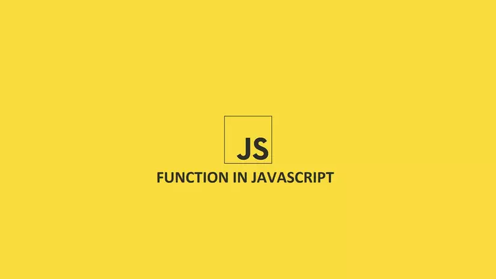
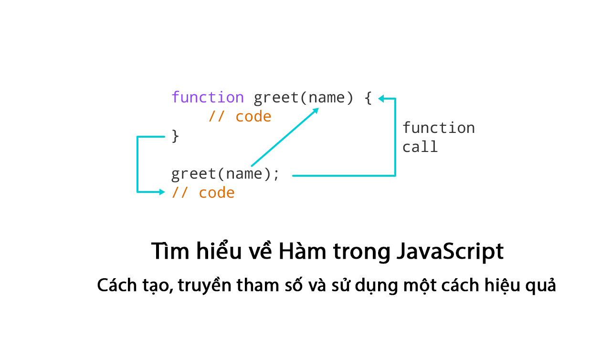

## Mục lục

1. [Hàm là gì?](#1-hàm-là-gì)
2. [Tại sao sử dụng hàm?](#2-tại-sao-sử-dụng-hàm)
3. [Khai báo hàm](#3-khai-báo-hàm)
4. [Gọi hàm](#4-gọi-hàm)
5. [Biến cục bộ trong hàm](#5-biến-cục-bộ-trong-hàm)
6. [Câu lệnh return](#6-câu-lệnh-return)
7. [Tham số (Parameters)](#7-tham-số-parameters)
8. [Shadowing](#8-shadowing)
9. [Kiểm tra tham số (Parameters Validation)](#9-kiểm-tra-tham-số)
10. [Đệ quy (Recursion)](#10-đệ-quy-recursion)
11. [Hàm như thành viên hạng nhất (First-class Citizens)](#11-hàm-như-thành-viên-hạng-nhất)
12. [Biểu thức hàm (Function Expressions)](#12-biểu-thức-hàm)
13. [Callbacks](#13-callbacks)
14. [Callbacks bất đồng bộ (Asynchronous Callbacks)](#14-callbacks-bất-đồng-bộ)
15. [setTimeout và setInterval](#15-settimeout-và-setinterval)
16. [Arrow Functions](#16-arrow-functions)
17. [Kết luận và mẹo sử dụng](#17-kết-luận-và-mẹo-sử-dụng)
18. [Tài liệu tham khảo](#18-tài-liệu-tham-khảo)

---

## 1. Hàm là gì?



Hàm (function) trong JavaScript là một khối mã nguồn độc lập, tạo thành một đơn vị logic khép kín, được thiết kế để thực hiện một nhiệm vụ cụ thể. Bạn có thể hình dung hàm như một "cỗ máy" nhỏ nhận đầu vào (nếu có), xử lý logic bên trong, và trả về đầu ra (nếu cần). Hàm có thể được gọi nhiều lần ở các vị trí khác nhau trong chương trình, giúp tái sử dụng mã hiệu quả.

- **Tên hàm:** Thường được đặt để dễ nhận biết, nhưng cũng có thể là hàm ẩn danh (anonymous) không có tên, thường dùng cho các tác vụ một lần.
- **Ví dụ đơn giản:** Hàm tính tổng hai số hoặc hàm hiển thị thông báo chào hỏi.
- **Tính linh hoạt:** Hàm có thể nhận tham số, trả về giá trị, hoặc chỉ thực thi tác vụ (như in ra console).

**Ví dụ minh họa:**
Hãy tưởng tượng bạn đang xây dựng một ứng dụng quản lý kho hàng. Thay vì viết lại công thức tính giá trị tồn kho (số lượng \* giá đơn vị) nhiều lần, bạn có thể đóng gói nó vào một hàm và gọi khi cần.

---

## 2. Tại sao sử dụng hàm?

Sử dụng hàm mang lại nhiều lợi ích thiết thực, đặc biệt trong các dự án lớn:

1. **Mô-đun hóa (Modularity):** Chia chương trình thành các phần nhỏ, độc lập, giúp mã dễ đọc, dễ bảo trì, và dễ debug. Ví dụ, một ứng dụng web có thể có hàm riêng để xử lý đăng nhập, hiển thị sản phẩm, hoặc tính tổng giỏ hàng.

2. **Tái sử dụng mã (Reusability):** Tránh lặp lại code (DRY - Don't Repeat Yourself). Một đoạn code được dùng nhiều nơi nên được đóng gói thành hàm, chỉ cần sửa một chỗ khi cần thay đổi.

3. **Kiểm tra dễ dàng (Testability):** Hàm độc lập có thể được kiểm tra riêng lẻ (unit test) mà không cần chạy toàn bộ chương trình.

4. **Tăng tính trừu tượng:** Ẩn chi tiết triển khai, chỉ lộ giao diện qua tham số và giá trị trả về, giúp mã dễ hiểu hơn.

**Ví dụ thực tế:** Tính trung bình nhiệt độ từ 24 phép đo mỗi ngày.

_Không dùng hàm:_

```javascript
let temperatures = [
  12, 12, 11, 11, 10, 9, 9, 10, 12, 13, 15, 18, 21, 24, 24, 23, 25, 25, 23, 21,
  20, 19, 17, 16,
];
let sum = 0;
for (let i = 0; i < temperatures.length; i++) {
  sum += temperatures[i];
}
let meanTemp = sum / temperatures.length;
console.log(`Trung bình ngày 1: ${meanTemp}`);

// Lặp lại cho ngày 2
temperatures = [
  17, 16, 14, 12, 10, 10, 10, 11, 13, 14, 15, 17, 22, 27, 29, 29, 27, 26, 24,
  21, 19, 18, 17, 16,
];
sum = 0;
for (let i = 0; i < temperatures.length; i++) {
  sum += temperatures[i];
}
meanTemp = sum / temperatures.length;
console.log(`Trung bình ngày 2: ${meanTemp}`);
```

_Có hàm:_

```javascript
function tinhTrungBinh(temps) {
  let sum = 0;
  for (let i = 0; i < temps.length; i++) {
    sum += temps[i];
  }
  return sum / temps.length;
}

let day1 = [
  12, 12, 11, 11, 10, 9, 9, 10, 12, 13, 15, 18, 21, 24, 24, 23, 25, 25, 23, 21,
  20, 19, 17, 16,
];
console.log(`Trung bình ngày 1: ${tinhTrungBinh(day1)}`); // 16.666666666666668

let day2 = [
  17, 16, 14, 12, 10, 10, 10, 11, 13, 14, 15, 17, 22, 27, 29, 29, 27, 26, 24,
  21, 19, 18, 17, 16,
];
console.log(`Trung bình ngày 2: ${tinhTrungBinh(day2)}`); // 18.083333333333332
```

**Trường hợp liên tưởng:**

- Trong ứng dụng game, hàm `updateScore(score, points)` có thể được gọi ở nhiều level để cập nhật điểm.
- Trong website, hàm `formatCurrency(amount)` định dạng tiền tệ (VD: 1000 -> 1,000 VNĐ) được dùng ở giỏ hàng, thanh toán, và lịch sử giao dịch.

---

## 3. Khai báo hàm

Hàm được khai báo bằng **function statement** với cú pháp:

```javascript
function tenHam(thamSo1, thamSo2, ...) {
    // Thân hàm: Các lệnh JavaScript
    // Có thể return giá trị
}
```

- **Tên hàm:** Phải tuân theo quy tắc đặt tên biến (không bắt đầu bằng số, không chứa ký tự đặc biệt trừ `_` và `$`). Nên đặt tên có ý nghĩa (VD: `tinhTong` thay vì `fn1`).
- **Tham số:** Tùy chọn, liệt kê trong `()`, cách nhau bằng dấu phẩy.
- **Thân hàm:** Khối mã `{}` chứa các lệnh thực thi.
- **Hoisting:** Khai báo hàm được "nâng" lên đầu scope, cho phép gọi trước khi khai báo.

**Ví dụ cơ bản:**

```javascript
function chaoHoi(ten) {
  console.log(`Xin chào, ${ten}!`);
}
chaoHoi("Alice"); // -> Xin chào, Alice!
```

**Ví dụ với hoisting:**

```javascript
chaoHoi("Bob"); // Hoạt động bình thường!

function chaoHoi(ten) {
  console.log(`Xin chào, ${ten}!`);
}
```

**Trường hợp khác:**

1. Hàm tính diện tích hình vuông:

```javascript
function dienTichHinhVuong(canh) {
  return canh * canh;
}
console.log(dienTichHinhVuong(5)); // -> 25
```

2. Hàm không tham số:

```javascript
function thongBao() {
  console.log("Hệ thống đang bảo trì...");
}
thongBao();
```

**Lưu ý:** Đặt khai báo hàm ở đầu file để tăng tính đọc, dù hoisting cho phép gọi trước.

---

## 4. Gọi hàm

Để chạy hàm, gọi bằng tên hàm theo sau dấu ngoặc `()` (có thể kèm đối số).

**Ví dụ:**

```javascript
chaoHoi("Eve"); // -> Xin chào, Eve!
```

- **Không đối số:** Chỉ cần `tenHam()`.
- **Có đối số:** Đối số phải khớp thứ tự tham số trong khai báo.
- **Gọi nhiều lần:** Có thể gọi trong vòng lặp, sự kiện, hoặc hàm khác.

**Ví dụ trong vòng lặp:**

```javascript
function inSoChan(n) {
  console.log(`Số chẵn: ${n * 2}`);
}

for (let i = 1; i <= 5; i++) {
  inSoChan(i); // In: Số chẵn: 2, 4, 6, 8, 10
}
```

**Ví dụ thực tế:**

Hàm tính trung bình nhiệt độ (đã tối ưu):

```javascript
function tinhTrungBinh(temps) {
  let sum = 0;
  for (let i = 0; i < temps.length; i++) {
    sum += temps[i];
  }
  return sum / temps.length;
}

let day1 = [
  12, 12, 11, 11, 10, 9, 9, 10, 12, 13, 15, 18, 21, 24, 24, 23, 25, 25, 23, 21,
  20, 19, 17, 16,
];
console.log(`Trung bình ngày 1: ${tinhTrungBinh(day1)}`);

let day2 = [
  17, 16, 14, 12, 10, 10, 10, 11, 13, 14, 15, 17, 22, 27, 29, 29, 27, 26, 24,
  21, 19, 18, 17, 16,
];
console.log(`Trung bình ngày 2: ${tinhTrungBinh(day2)}`);
```

**Trường hợp liên tưởng:**

- Gọi hàm `sendNotification()` khi người dùng nhấn nút trong ứng dụng.
- Gọi hàm `calculateTax()` trong giỏ hàng e-commerce.

**Lưu ý:** Gọi hàm không tồn tại gây lỗi `ReferenceError`. Tránh gọi đệ quy vô hạn (stack overflow).

---

## 5. Biến cục bộ trong hàm

Biến khai báo trong hàm (bằng `let` hoặc `var`) chỉ tồn tại trong phạm vi hàm đó, gọi là **biến cục bộ**.

- **`let`:** Giới hạn trong block `{}` gần nhất.
- **`var`:** Giới hạn trong toàn bộ hàm.
- **Lợi ích:** Tránh xung đột với biến toàn cục, giữ hàm độc lập.

**Ví dụ:**

```javascript
function tinhTong() {
  let a = 5; // Chỉ visible trong hàm
  var b = 10; // Chỉ visible trong hàm
  console.log(a + b);
}
tinhTong(); // -> 15
// console.log(a); // Lỗi: a không tồn tại
```

**Ví dụ trong hàm tính trung bình:**

```javascript
function tinhTrungBinh(temps) {
  let sum = 0; // Biến cục bộ
  for (let i = 0; i < temps.length; i++) {
    sum += temps[i];
  }
  return sum / temps.length;
}
```

**Trường hợp thực tế:**

- Trong hàm xử lý form đăng nhập, biến `errorMessage` chỉ cần tồn tại trong hàm để lưu thông báo lỗi tạm thời.
- Trong game, biến `playerHealth` trong hàm `updateGameState()` không nên ảnh hưởng đến biến toàn cục cùng tên.

**Lưu ý:** Tránh dùng biến toàn cục trong hàm để giữ tính độc lập.

---

## 6. Câu lệnh return

Câu lệnh `return` có hai vai trò:

1. Kết thúc hàm ngay lập tức.
2. Trả về giá trị (nếu có) đến nơi gọi hàm.

- **Không giá trị:** Chỉ kết thúc hàm (thường dùng khi xử lý lỗi).
- **Có giá trị:** Trả về biểu thức (số, chuỗi, object, v.v.).
- **Mặc định:** Nếu không có `return`, hàm trả về `undefined`.

**Ví dụ kết thúc sớm:**

```javascript
function kiemTraSoDuong(n) {
  if (n < 0) return "Số âm không hợp lệ";
  return "Số dương";
}
console.log(kiemTraSoDuong(-5)); // -> Số âm không hợp lệ
```

**Ví dụ trả về giá trị:**

```javascript
function binhPhuong(x) {
  return x * x;
}
let ketQua = binhPhuong(4);
console.log(ketQua); // -> 16
```

**Áp dụng vào hàm tính trung bình:**

```javascript
function tinhTrungBinh(temps) {
  let sum = 0;
  for (let i = 0; i < temps.length; i++) {
    sum += temps[i];
  }
  return sum / temps.length;
}
console.log(tinhTrungBinh([10, 20, 30])); // -> 20
```

**Trường hợp khác:**

- Hàm trả về object trong API:

```javascript
function layThongTinNguoiDung(id) {
  return { id, name: "Alice", age: 30 };
}
console.log(layThongTinNguoiDung(1)); // -> { id: 1, name: "Alice", age: 30 }
```

**Lưu ý:** Code sau `return` không chạy. Đảm bảo return giá trị đúng kiểu dữ liệu cần thiết.

---

## 7. Tham số (Parameters)

Tham số là biến cục bộ nhận giá trị khi hàm được gọi (gọi là **đối số - arguments**).

- **Tùy chọn:** Hàm có thể không có tham số.
- **Thứ tự:** Đối số phải khớp thứ tự tham số trong khai báo.
- **Mặc định (ES6):** Có thể gán giá trị mặc định.

**Ví dụ cơ bản:**

```javascript
function cong(a, b = 0) {
  // Tham số mặc định
  return a + b;
}
console.log(cong(5)); // -> 5 (b = 0)
console.log(cong(5, 3)); // -> 8
```

**Tham số phức tạp:**

```javascript
function xuLyMang(arr) {
  return arr.sort((a, b) => a - b);
}
console.log(xuLyMang([3, 1, 2])); // -> [1, 2, 3]
```

**Áp dụng vào hàm tính trung bình:**

```javascript
function tinhTrungBinh(temperatures) {
  let sum = 0;
  for (let i = 0; i < temperatures.length; i++) {
    sum += temperatures[i];
  }
  return sum / temperatures.length;
}

let day1 = [
  12, 12, 11, 11, 10, 9, 9, 10, 12, 13, 15, 18, 21, 24, 24, 23, 25, 25, 23, 21,
  20, 19, 17, 16,
];
console.log(`Trung bình ngày 1: ${tinhTrungBinh(day1)}`);

let day2 = [
  17, 16, 14, 12, 10, 10, 10, 11, 13, 14, 15, 17, 22, 27, 29, 29, 27, 26, 24,
  21, 19, 18, 17, 16,
];
console.log(`Trung bình ngày 2: ${tinhTrungBinh(day2)}`);
```

**Trường hợp thực tế:**

- Hàm `sendEmail(to, subject, body)` trong ứng dụng gửi thông báo.
- Hàm `renderChart(data, options)` trong thư viện vẽ biểu đồ.

**Lưu ý:** Tránh lạm dụng tham số (giới hạn 3-5 tham số). Nếu cần nhiều, dùng object.

```javascript
function configChart({ data, type, color }) {
  console.log(`Biểu đồ ${type}:`, data, color);
}
```

---

## 8. Shadowing

Tham số và biến cục bộ **che lấp** (shadow) biến toàn cục cùng tên.

**Ví dụ:**

```javascript
let x = 100;
function test(x) {
  // Shadow x toàn cục
  let y = 10; // Shadow y toàn cục (nếu có)
  console.log(x, y);
}
test(50); // -> 50, 10
console.log(x); // -> 100
```

**Ví dụ phức tạp hơn:**

```javascript
let first = 10,
  second = 20,
  third = 40,
  fourth = 80;

function cong(first, second) {
  // Shadow first, second
  return first + second + third + fourth; // third, fourth là toàn cục
}
console.log(cong(5, 7)); // -> 5 + 7 + 40 + 80 = 132
```

**Lợi ích:** Ngăn xung đột tên biến trong dự án lớn.

**Trường hợp thực tế:** Trong thư viện, shadowing đảm bảo hàm không vô tình thay đổi biến toàn cục của ứng dụng.

---

## 9. Kiểm tra tham số (Parameters Validation)

Kiểm tra đầu vào để tránh lỗi runtime hoặc kết quả không mong muốn.

**Ví dụ trong hàm tính trung bình:**

```javascript
function tinhTrungBinh(temperatures) {
  if (!(temperatures instanceof Array)) {
    return NaN; // Không phải mảng
  }
  let sum = 0;
  for (let i = 0; i < temperatures.length; i++) {
    if (typeof temperatures[i] !== "number") return NaN; // Không phải số
    sum += temperatures[i];
  }
  return sum / temperatures.length;
}

console.log(tinhTrungBinh(10)); // -> NaN
console.log(tinhTrungBinh([10, "20"])); // -> NaN
console.log(tinhTrungBinh([10, 20, 30])); // -> 20
```

**Ví dụ kiểm tra email:**

```javascript
function isValidEmail(email) {
  if (typeof email !== "string") return false;
  const regex = /^[^\s@]+@[^\s@]+\.[^\s@]+$/;
  return regex.test(email);
}
console.log(isValidEmail("test@example.com")); // -> true
console.log(isValidEmail(123)); // -> false
```

**Trường hợp thực tế:**

- Kiểm tra input form (email, password length).
- Validate tham số API trước khi gửi request.

**Lưu ý:** Sử dụng `throw` để ném lỗi trong các ứng dụng nghiêm ngặt.

```javascript
function chia(a, b) {
  if (b === 0) throw new Error("Không chia cho 0");
  return a / b;
}
```

---

## 10. Đệ quy (Recursion)

Hàm gọi chính nó với đối số khác, thường dùng để giải bài toán có cấu trúc lặp.

- **Base case:** Điều kiện dừng để tránh vô hạn.
- **Recursive case:** Gọi lại hàm với vấn đề nhỏ hơn.

**Ví dụ giai thừa (iterative vs recursive):**

_Iterative:_

```javascript
function giaiThua(n) {
  let result = 1;
  while (n > 1) {
    result *= n;
    n--;
  }
  return result;
}
console.log(giaiThua(6)); // -> 720
```

_Recursive:_

```javascript
function giaiThua(n) {
  return n <= 1 ? 1 : n * giaiThua(n - 1);
}
console.log(giaiThua(6)); // -> 720
```


**Quá trình đệ quy cho 6!:**

- `giaiThua(6) = 6 * giaiThua(5)`
- `giaiThua(5) = 5 * giaiThua(4)`
- ...
- `giaiThua(1) = 1`
- Kết quả: `6 * 5 * 4 * 3 * 2 * 1 = 720`

**Ví dụ khác: Số Fibonacci**

```javascript
function fibonacci(n) {
  if (n <= 1) return n;
  return fibonacci(n - 1) + fibonacci(n - 2);
}
console.log(fibonacci(5)); // -> 5 (dãy: 0, 1, 1, 2, 3, 5)
```

**Trường hợp thực tế:**

- Duyệt cây thư mục (file system tree).
- Tìm đường đi trong đồ thị (DFS - Depth First Search).

**Lưu ý:**

- Đệ quy tốn bộ nhớ stack (giới hạn ~10k calls).
- Dùng vòng lặp nếu hiệu suất là ưu tiên.

---

## 11. Hàm như thành viên hạng nhất (First-class Citizens)

Trong JavaScript, hàm được coi là **first-class citizens**, nghĩa là chúng có thể:

- Lưu vào biến.
- Truyền làm đối số.
- Trả về từ hàm khác.

**Ví dụ lưu vào biến:**

```javascript
let sayHi = function () {
  console.log("Xin chào!");
};
sayHi(); // -> Xin chào!
console.log(typeof sayHi); // -> function
```

**Truyền làm đối số:**

```javascript
function thucHien(phepTinh, a, b) {
  return phepTinh(a, b);
}
let cong = (x, y) => x + y;
console.log(thucHien(cong, 2, 3)); // -> 5
```

**Trả về hàm:**

```javascript
function taoBoDem() {
  let dem = 0;
  return function () {
    return ++dem;
  };
}
let dem = taoBoDem();
console.log(dem()); // -> 1
console.log(dem()); // -> 2
```

**Trường hợp thực tế:**

- Hàm `map`, `filter` trong mảng.
- Callback trong event listener.

---

## 12. Biểu thức hàm (Function Expressions)

Hàm có thể được khai báo như một biểu thức và gán cho biến.

- **Có tên:** `let fn = function ten() {...};`
- **Ẩn danh:** `let fn = function() {...};`

**Ví dụ có tên:**

```javascript
let cong = function cong(a, b) {
  return a + b;
};
console.log(cong(10, 20)); // -> 30
```

**Ẩn danh:**

```javascript
let tru = function (a, b) {
  return a - b;
};
console.log(tru(20, 10)); // -> 10
```

**Truyền trực tiếp:**

```javascript
function thucHien(fn, a, b) {
  return fn(a, b);
}
console.log(
  thucHien(
    function (a, b) {
      return a * b;
    },
    10,
    20
  )
); // -> 200
```

**Trường hợp thực tế:**

- IIFE (Immediately Invoked Function Expression):

```javascript
(function () {
  console.log("Chạy ngay lập tức!");
})();
```

- Callback trong array methods:

```javascript
[1, 2, 3].map(function (n) {
  return n * 2;
}); // -> [2, 4, 6]
```

**Lưu ý:** Biểu thức hàm không được hoisted như function statement.

---

## 13. Callbacks

**Callback** là hàm được truyền làm đối số cho hàm khác, được gọi trong hàm đó.

**Ví dụ đồng bộ:**

```javascript
function xuLy(callback) {
  console.log("Bắt đầu xử lý...");
  callback();
  console.log("Kết thúc xử lý.");
}
xuLy(function () {
  console.log("Callback chạy!");
});
// Output:
// Bắt đầu xử lý...
// Callback chạy!
// Kết thúc xử lý.
```

**Trường hợp thực tế:**

- Xử lý mảng với `forEach`:

```javascript
let names = ["Alice", "Bob", "Eve"];
names.forEach(function (name) {
  console.log(`Xin chào, ${name}!`);
});
```

---

## 14. Callbacks bất đồng bộ (Asynchronous Callbacks)

Callback bất đồng bộ được thực thi dựa trên sự kiện (event-driven), không theo thứ tự mã nguồn.

**Ví dụ với setTimeout:**

```javascript
function xuLyAsync(callback) {
  console.log("Bắt đầu...");
  setTimeout(callback, 1000);
  console.log("Kết thúc.");
}
xuLyAsync(function () {
  console.log("Callback sau 1s");
});
// Output:
// Bắt đầu...
// Kết thúc.
// (1s sau) Callback sau 1s
```

**Ví dụ event listener:**

```javascript
window.addEventListener("click", function () {
  console.log("Đã click vào trang!");
});
```

**Trường hợp thực tế:**

- Fetch dữ liệu từ API:

```javascript
fetch("https://api.example.com/data")
  .then(function (response) {
    return response.json();
  })
  .then(function (data) {
    console.log(data);
  });
```

**Lưu ý:** Dùng Promise hoặc async/await để quản lý bất đồng bộ tốt hơn.

---

## 15. setTimeout và setInterval

- **`setTimeout(callback, ms)`:** Chạy callback một lần sau `ms` mili-giây.
- **`setInterval(callback, ms)`:** Lặp lại callback mỗi `ms` mili-giây, trả về `id` để dừng bằng `clearInterval(id)`.

**Ví dụ dừng interval:**

```javascript
function batDongHo() {
  let count = 0;
  let id = setInterval(function () {
    console.log(`Tick ${++count}`);
    if (count >= 5) clearInterval(id);
  }, 1000);
}
batDongHo();
```

**Trường hợp thực tế:**

- Animation loop trong game.
- Polling API để cập nhật dữ liệu real-time.

---

## 16. Arrow Functions

**Arrow function** là dạng ngắn gọn của biểu thức hàm, sử dụng `=>`.

- **Cú pháp:** `(thamSo) => bieuThuc`
- **Một tham số:** Có thể bỏ ngoặc: `x => x * x`
- **Một lệnh:** Bỏ `return` và `{}`: `(a, b) => a + b`
- **Khác biệt:** Không bind `this` riêng (dùng trong OOP).

**Ví dụ:**

```javascript
let cong = (a, b) => a + b;
console.log(cong(10, 20)); // -> 30
```

**Với body lớn:**

```javascript
let kiemTraSo = (n) => {
  if (n > 0) return "Dương";
  return "Không dương";
};
console.log(kiemTraSo(5)); // -> Dương
```

**Trong array method:**

```javascript
let numbers = [1, 2, 3];
numbers.forEach((n) => console.log(n * 2)); // -> 2, 4, 6
```

**Trường hợp thực tế:**

- Callback ngắn trong React hooks.
- Sort mảng: `numbers.sort((a, b) => a - b)`.

---

## 17. Kết luận và mẹo sử dụng

Hàm là nền tảng của lập trình JavaScript, giúp mã nguồn trở nên linh hoạt, dễ bảo trì. Một số mẹo:

1. **Giữ hàm ngắn:** <50 dòng, tập trung một nhiệm vụ.
2. **Sử dụng tham số mặc định:** `function fn(a = 0) {...}`
3. **Tránh side effects:** Không thay đổi biến ngoài hàm trừ khi cần thiết.
4. **Kiểm tra tham số:** Luôn validate đầu vào.
5. **Học thêm:** Closures, Generators, async/await để nâng cao kỹ năng.
6. **Thực hành:** Xây mini-project như calculator, todo list, hoặc game đơn giản.

---

## 18. Tài liệu tham khảo

- [MDN Web Docs: Functions](https://developer.mozilla.org/en-US/docs/Web/JavaScript/Guide/Functions)
- [JavaScript.info: Functions](https://javascript.info/function-basics)
- [ECMAScript Specification: Functions](https://tc39.es/ecma262/#sec-functions)
