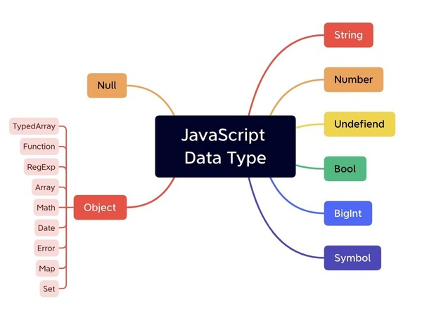
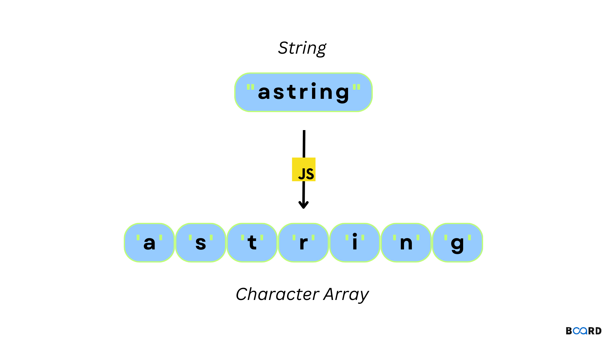

## A. Kiểu Dữ Liệu



Trong JavaScript, có 6 kiểu dữ liệu cơ bản:

- **Number**
- **Boolean**
- **String**
- **Null**
- **Undefined**
- **Object**

Mặc dù JavaScript là ngôn ngữ weak type (kiểu yếu), không có nghĩa là nó không có khái niệm kiểu dữ liệu. JavaScript không yêu cầu chỉ định rõ ràng kiểu dữ liệu và có khả năng ép kiểu linh hoạt.

### Kiểu Nguyên Thủy (Primitive Types)

Năm kiểu đầu (Number, Boolean, String, Null, Undefined) được gọi là primitive types. Chúng chỉ chứa dữ liệu thuần túy, ví dụ:

```javascript
let x = 10;
let s = "Hello";
let z = true;
```

Các kiểu primitive có thể sử dụng method và property như object nhờ cơ chế wrapper. Khi gọi method/property, JavaScript tạm thời biến đổi primitive thành object:

```javascript
let x = new Number(10);
let s = new String("Hello");
let z = new Boolean(true);
```

Tuy nhiên, tránh sử dụng cách này vì nó gây rối, dài dòng và có thể dẫn đến lỗi so sánh (luôn trả về `false` do so sánh địa chỉ). Thay vào đó, dùng `valueOf()` để lấy giá trị primitive từ wrapper.

### Kiểu Object

Kiểu `object` chứa thuộc tính (property) và phương thức (method), được khởi tạo bằng `new Object()` hoặc cú pháp ngắn gọn `{}`:

```javascript
let obj = new Object();
let obj2 = {
  ten: "Nguyen Van A",
  tuoi: 25,
};
```

Từ `object`, ta có các biến thể như mảng (array), function, Date, v.v.

## B. Number

### 1. Tổng Quan

`Number` dùng cho cả số nguyên và số thực, luôn có dấu (signed). Kiểu được xác định dựa trên giá trị gán:

```javascript
let a = 5,
  b = 2.5; // Nhiều biến cùng dòng
let c = 12e-3; // Dạng khoa học
let d = 0.25; // Rút gọn 0.25
let e = 10; // Viết nhiều dòng
```

Số có thể viết dạng hexa (`0xff`) hoặc octal (`017`), nhưng tránh bắt đầu bằng 0 trừ khi hiểu rõ.

### 2. Toán Tử

Toán tử trong JS giống các ngôn ngữ khác, từ ES6 có thêm `**` (lũy thừa). Phép cộng đặc biệt khi kết hợp number và string:

```javascript
let x = 5;
let y = "Hi " + x; // y = "Hi 5"
```

Nhân chia giữa string số sẽ tự ép kiểu:

```javascript
let s1 = "2000";
let s2 = "10";
let result = s1 / s2; // result = 200
```

### 3. Giá Trị Đặc Biệt

- **NaN**: Kết quả phép tính không hợp lệ (ví dụ: `100 / "Apple"`), kiểm tra bằng `isNaN()`.
- **Infinity**: Kết quả quá lớn hoặc chia cho 0, kiểm tra bằng `isFinite()`.

### 4. Phương Thức Number

Phương thức như `toString()` có thể gọi trực tiếp từ giá trị:

```javascript
let x = 123;
x.toString(); // "123"
(100 + 23).toString(); // "123"
```

### 5. Thuộc Tính Number

Truy cập qua `Number`, không qua biến:

```javascript
Number.MAX_VALUE;       // Ok
123.MAX_VALUE;          // Sai
```

## C. Boolean

### 1. Tổng Quan

`Boolean` lưu trữ `true` hoặc `false`, dùng trong điều kiện:

```javascript
let b = false;
if (b) console.log("Đúng");
```

### 2. Truthy & Falsy

- **Falsy**: `0`, `false`, `""`, `null`, `undefined`, `NaN`.
- **Truthy**: Ngược lại, bao gồm `Infinity`, `-Infinity`.
- Ép kiểu: `!!x` biến thành `Boolean`.

```javascript
let x = 10,
  y = 0;
console.log(!!x); // true
console.log(!!y); // false
```

### 3. Thuộc Tính & Phương Thức

Chỉ có `toString()` và `valueOf()`.

### 4. Mẹo Boolean

- **Shorthand**: `<condition> && <statement>` thay cho `if`.
- **Default Value**: `fileName = fileName || "Noname.txt";` thay cho kiểm tra rỗng.

## D. String



### 1. Tổng Quan

`String` lưu dữ liệu text, dùng nháy đơn hoặc kép:

```javascript
let s1 = "I'm Vu"; // Nháy kép
let s2 = 'He said "ABC"'; // Nháy đơn
```

Truy cập ngoài phạm vi trả về `undefined`. Chuỗi là mảng ký tự, index từ 0.

### 2. Thuộc Tính & Phương Thức

- **Length**: `s.length` (không dùng `()`).
- **Truy Cập Ký Tự**: `s[0]`, `s.charAt(1)`, `s.charCodeAt(2)`.
- **Nối Chuỗi**: `s1.concat(" ", s2)`.
- **Trim**: `s.trim()` loại bỏ khoảng trắng.
- **Chuyển Hoa/Thường**: `s.toUpperCase()`, `s.toLowerCase()`.
- **Tìm Vị Trí**: `s.indexOf("nh")`, `s.lastIndexOf("nh")`, `s.search(/anh/i)`.
- **Trích Xuất**: `s.substring(0, 3)`, `s.substr(4, 3)`, `s.slice(-3)`.
- **Thay Thế**: `s.replace("anh", "em")`.
- **Tách Chuỗi**: `s.split(" ")`, `s.split(/ {1,}/)`.

## E. Array 1

### 1. Tổng Quan

`Array` lưu nhiều giá trị, truy cập bằng index (từ 0):

```javascript
let primes = [2, 3, 5, 7];
let third_prime = primes[2]; // 5
```

Array cho phép nhiều kiểu dữ liệu, không giới hạn số phần tử.

### 2. Array và Object

Array là object, `typeof primes` trả về `object`. Có thể dùng constructor `new Array(2, 3, 5, 7)` nhưng nên dùng `[]`.

### 3. Thuộc Tính & Phương Thức

- **Length**: `primes.length`.
- **Thêm/Phổ**: `push()`, `unshift()`, `pop()`, `shift()`.
- **Xóa**: `delete primes[2]`.

## F. Array 2

### 1. Phương Thức 2

- **Concat**: `a.concat(b)`.
- **Splice**: `primes.splice(2, 1, 5, 7)`.
- **Slice**: `primes.slice(0, 4)`.
- **Join**: `primes.join(", ")`.
- **Find**: `a.includes(2)`, `a.indexOf(2)`.

### 2. Constructor Methods

- **isArray**: `Array.isArray(primes)`.
- **of**: `Array.of(1, 2, 3)`.
- **from**: `Array.from(a, x => x * 2)`.

### 3. Sắp Xếp

- **Sort**: `primes.sort((a, b) => a - b)`.

### 4. Tìm Max/Min

- `Math.max.apply(null, primes)`.

## G. Array Iteration Methods

### 1. Tổng Quan

Phương thức lặp như `forEach()`, `map()`, `filter()`, v.v., dùng callback function.

### 2. Phương Thức Lặp

- **forEach**: `a.forEach((value, index) => console.log(value))`.
- **Map**: `b = a.map(x => x * 2)`.
- **Filter**: `c = primes.filter(x => x < 10)`.
- **Every/Some**: `primes.every(x => x > 0)`, `primes.some(x => x > 10)`.
- **Find**: `a.findIndex(x => x > 10)`.
- **Reduce**: `sum = a.reduce((prev, curr) => prev + curr)`.

### 3. Arrow Function

Sử dụng `=>` để viết ngắn gọn:

```javascript
let b = a.map((x) => x * 2);
```

## H. Date

### 1. Đối Tượng Date

Tạo `Date` với các cách:

- **Hiện Tại**: `let current = new Date();`
- **Tùy Chỉnh**: `let birthday = new Date(2001, 7, 27);`
- **Miliseconds**: `let root = new Date(0);`
- **Chuỗi**: `let birthday = new Date("August 27, 2001");`

### 2. Định Dạng Date

- **ISO**: `2001-08-27`, `2001-08-27T06:30:00Z`.
- **Long Date**: `August 27 2001`.
- **Short Date**: `08/27/2001`.

### 3. Get/Set Methods

- **Get**: `d.getFullYear()`, `d.getMonth()`.
- **Set**: `d.setMonth(7)`.

### 4. Thao Tác Date

- **Hiển Thị**: `d.toString()`.
- **Miliseconds**: `Date.parse("August 27, 2001")`.
- **So Sánh**: `d1.getTime() > d2.getTime()`.
- **Cộng Ngày**: `tomorrow.setDate(today.getDate() + 1)`.
