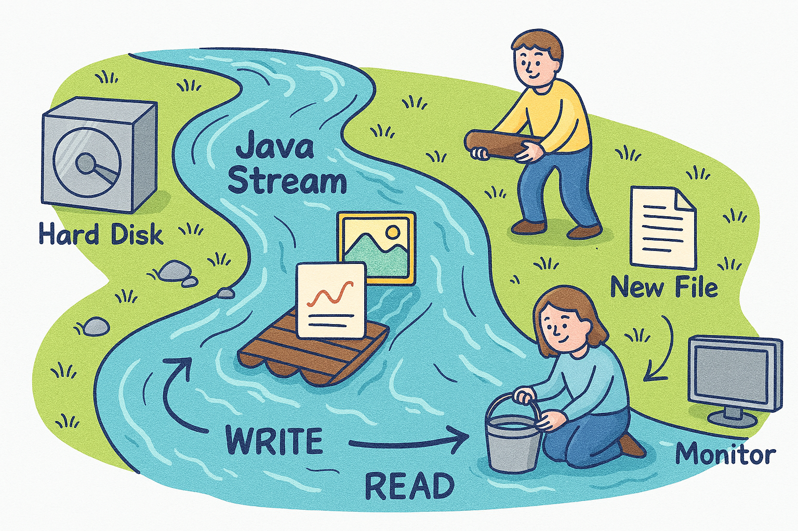
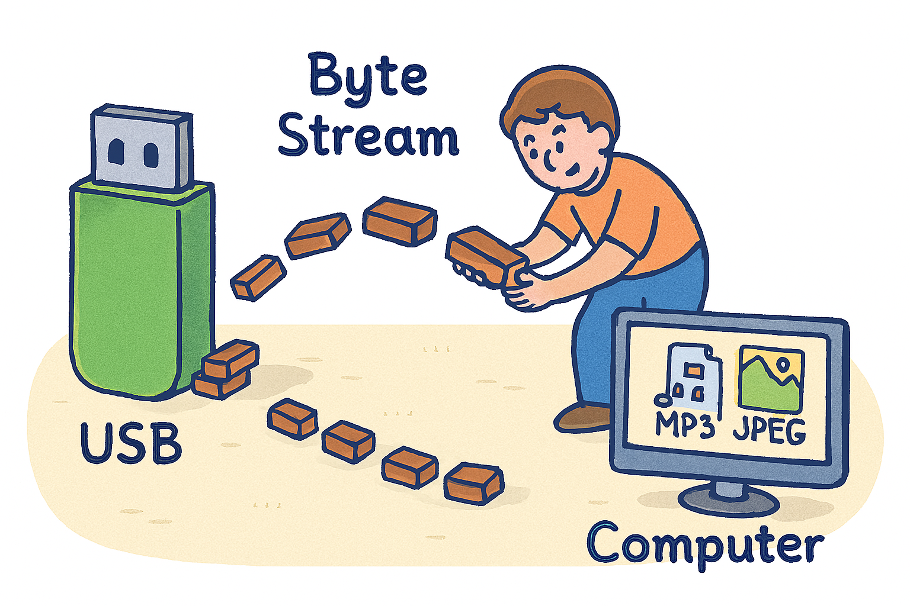
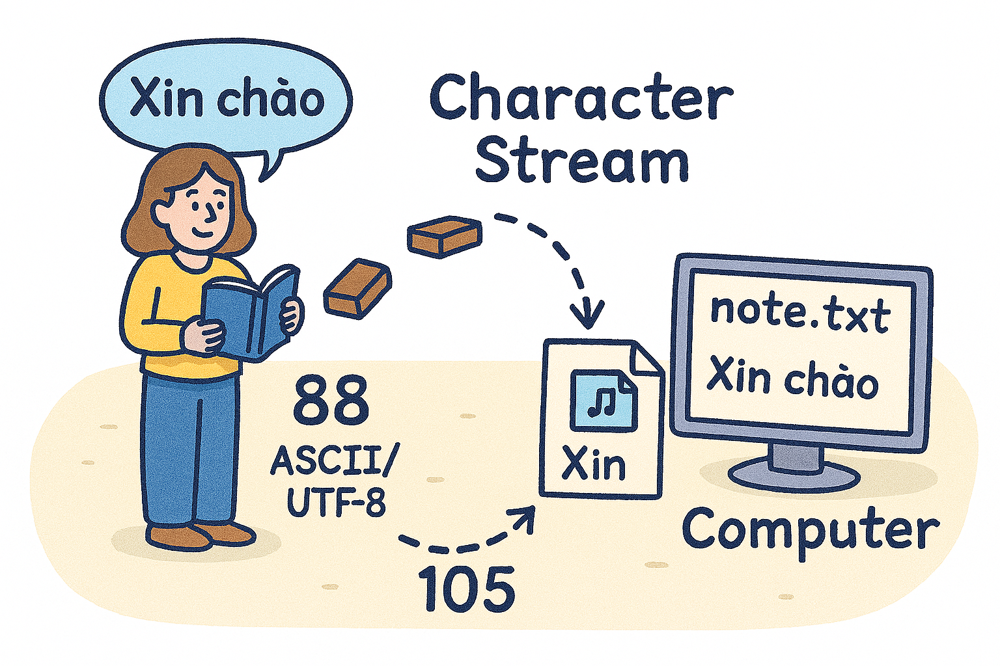
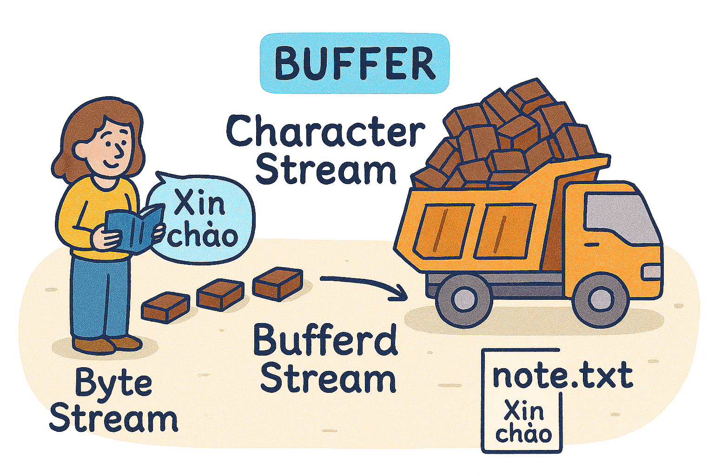
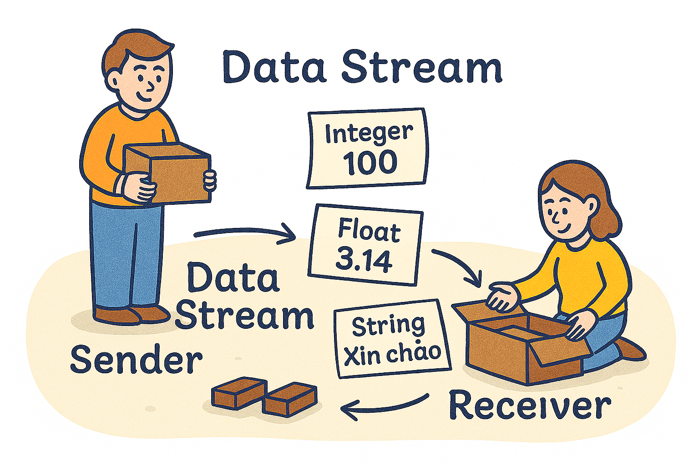
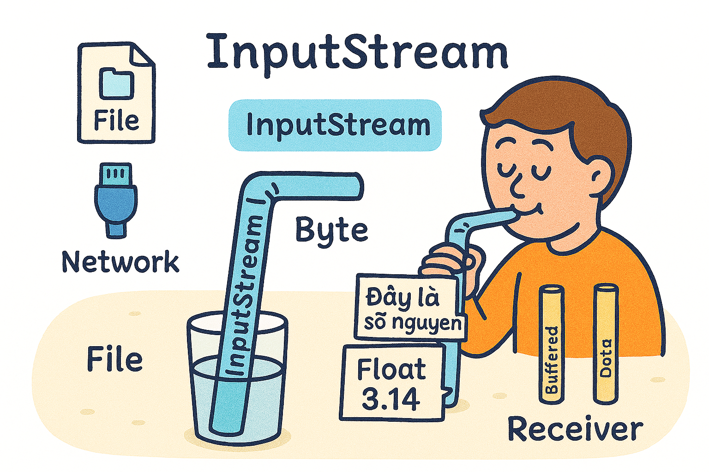
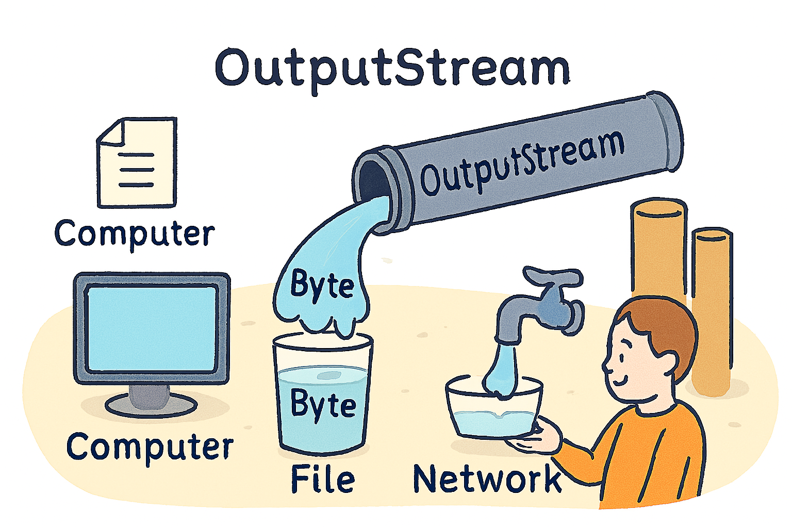
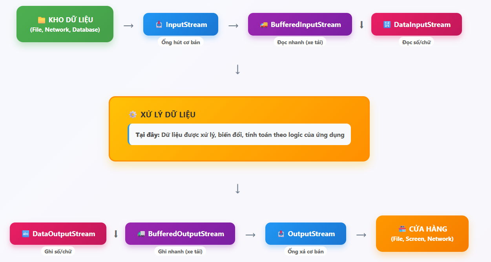

Stream trong Java giống như những **con sông** chở dữ liệu trong máy tính. Dữ liệu (như file ảnh, văn bản, số liệu) được "chở" từ nơi này (ví dụ: ổ cứng) đến nơi khác (ví dụ: file mới hoặc màn hình). Stream giúp chúng ta **đọc** (lấy nước từ sông) hoặc **ghi** (đổ nước vào sông) dữ liệu. Hãy tưởng tượng tôi đang giải thích cho một người bạn chưa biết gì về lập trình, dùng ngôn ngữ đơn giản và ví dụ đời thường.



## 1. Byte Stream: Chở hàng thô

**Hình ảnh đời thường**: Tưởng tượng bạn copy file nhạc MP3 hoặc ảnh JPEG từ USB sang máy tính. Bạn không cần biết trong file có gì, chỉ chép nguyên xi từng mẩu nhỏ (gọi là **byte**, như từng viên gạch). Đó là **Byte Stream**.



**Giải thích đơn giản**:

- Byte Stream chở dữ liệu dưới dạng **byte** (8 bit, như mã số nhỏ).
- Dùng cho dữ liệu nhị phân: ảnh, video, nhạc, file PDF.
- Giống xe tải chở hàng thô, không quan tâm bên trong là gì.

**Ví dụ đời thường**: Copy file ảnh "cat.jpg" từ máy sang USB. Byte Stream lấy từng mẩu nhỏ của ảnh và chép sang.

**Ví dụ code Java**:

```java
import java.io.FileInputStream;
import java.io.FileOutputStream;
import java.io.IOException;

public class ByteStreamExample {
    public static void main(String[] args) {
        try {
            FileInputStream fis = new FileInputStream("cat.jpg"); // Mở "sông" đọc từ file ảnh
            FileOutputStream fos = new FileOutputStream("copy_cat.jpg"); // Mở "sông" ghi ra file mới

            int byteData;
            while ((byteData = fis.read()) != -1) { // Đọc từng byte
                fos.write(byteData); // Ghi byte đó ra
            }

            fis.close();
            fos.close();
            System.out.println("Đã chép ảnh xong!");
        } catch (IOException e) {
            System.out.println("Có lỗi xảy ra: " + e.getMessage());
        }
    }
}
```

**Tại sao chậm?** Đọc từng byte giống như bê từng viên gạch – đúng nhưng mất thời gian.

---

## 2. Character Stream: Chở chữ cái

**Hình ảnh đời thường**: Bạn mở file "note.txt" chứa câu "Xin chào". Nếu dùng Byte Stream, bạn thấy số (như 88, 105 – mã ASCII/UTF-8). **Character Stream** giống người dịch, biến số thành chữ "Xin chào" để bạn đọc dễ dàng.



**Giải thích đơn giản**:

- Character Stream chở **ký tự** (như chữ A, B, hoặc "ă", "ế").
- Tự động dịch byte thành ký tự theo bảng mã (như UTF-8).
- Dùng cho file văn bản: .txt, .java, .html.

**Ví dụ đời thường**: Copy file "note.txt" chứa "Xin chào" sang file mới. Character Stream chép đúng chữ, không lo mã số.

**Ví dụ code Java**:

```java
import java.io.FileReader;
import java.io.FileWriter;
import java.io.IOException;

public class CharacterStreamExample {
    public static void main(String[] args) {
        try {
            FileReader fr = new FileReader("note.txt"); // Mở "sông" đọc chữ
            FileWriter fw = new FileWriter("copy_note.txt"); // Mở "sông" ghi chữ

            int charData;
            while ((charData = fr.read()) != -1) { // Đọc từng ký tự
                fw.write(charData); // Ghi ký tự đó ra
            }

            fr.close();
            fw.close();
            System.out.println("Đã chép file text xong!");
        } catch (IOException e) {
            System.out.println("Có lỗi xảy ra: " + e.getMessage());
        }
    }
}
```

**Tại sao tiện?** Bạn không cần tự dịch mã số thành chữ – Character Stream làm sẵn.

---

## 3. Buffered Stream: Xe tải lớn thay vì xe máy

**Hình ảnh đời thường**: Thay vì bê từng viên gạch (Byte Stream) hoặc từng chữ (Character Stream), bạn dùng **xe tải lớn** chở cả đống cùng lúc. **Buffered Stream** giống xe tải: gom dữ liệu vào thùng lớn (buffer) trước khi chở, nên nhanh hơn.



**Giải thích đơn giản**:

- Buffered Stream thêm **bộ đệm** để gom dữ liệu trước khi đọc/ghi.
- Giảm số lần máy tính làm việc với ổ cứng, nên nhanh hơn.
- Dùng được với cả Byte Stream và Character Stream.

**Ví dụ đời thường**: Copy file ảnh "cat.jpg" bằng xe tải chở 1MB mỗi lần, hoặc copy "note.txt" từng câu thay vì từng chữ.

**Ví dụ code Java** (cho text):

```java
import java.io.BufferedReader;
import java.io.BufferedWriter;
import java.io.FileReader;
import java.io.FileWriter;
import java.io.IOException;

public class BufferedStreamExample {
    public static void main(String[] args) {
        try {
            BufferedReader br = new BufferedReader(new FileReader("note.txt")); // Đọc chữ với buffer
            BufferedWriter bw = new BufferedWriter(new FileWriter("copy_note.txt")); // Ghi chữ với buffer

            String line;
            while ((line = br.readLine()) != null) { // Đọc cả dòng
                bw.write(line); // Ghi cả dòng
                bw.newLine(); // Thêm dòng mới
            }

            br.close();
            bw.close();
            System.out.println("Đã chép file text nhanh hơn!");
        } catch (IOException e) {
            System.out.println("Có lỗi xảy ra: " + e.getMessage());
        }
    }
}
```

**Tại sao nhanh?** Chở cả xe tải thay vì đi lại từng lần, tiết kiệm thời gian.

---

## 4. Data Stream: Ghi nhãn hàng hóa

**Hình ảnh đời thường**: Bạn gửi gói hàng chứa số 100, số 3.14, và chữ "Xin chào". Nếu dùng Byte Stream, người nhận chỉ thấy byte thô, không biết cái nào là số, cái nào là chữ. **Data Stream** giống như ghi nhãn: "Đây là số nguyên 100", "Đây là số thập phân 3.14", "Đây là chữ Xin chào". Khi nhận, mở đúng thứ tự và loại.



**Giải thích đơn giản**:

- Data Stream ghi/đọc dữ liệu **nguyên thủy** (int, double, boolean) và String.
- Đảm bảo dữ liệu giữ đúng kiểu và thứ tự khi đọc lại.
- Dùng cho mạng hoặc lưu số liệu vào file.

**Ví dụ đời thường**: Lưu điểm số học sinh (90, 8.5, true, "Tèo") vào file, sau này mở ra vẫn đúng kiểu.

**Ví dụ code Java**:

```java
import java.io.DataInputStream;
import java.io.DataOutputStream;
import java.io.FileInputStream;
import java.io.FileOutputStream;
import java.io.IOException;

public class DataStreamExample {
    public static void main(String[] args) {
        // Ghi dữ liệu
        try {
            DataOutputStream dos = new DataOutputStream(new FileOutputStream("data.txt"));
            dos.writeInt(90); // Ghi số nguyên
            dos.writeDouble(8.5); // Ghi số thập phân
            dos.writeBoolean(true); // Ghi true/false
            dos.writeUTF("Tèo"); // Ghi chuỗi
            dos.close();
            System.out.println("Đã ghi dữ liệu!");
        } catch (IOException e) {
            System.out.println("Lỗi khi ghi: " + e.getMessage());
        }

        // Đọc dữ liệu
        try {
            DataInputStream dis = new DataInputStream(new FileInputStream("data.txt"));
            int score = dis.readInt(); // Đọc số nguyên
            double grade = dis.readDouble(); // Đọc số thập phân
            boolean passed = dis.readBoolean(); // Đọc true/false
            String name = dis.readUTF(); // Đọc chuỗi

            System.out.println("Điểm: " + score);
            System.out.println("Điểm thập phân: " + grade);
            System.out.println("Đậu: " + passed);
            System.out.println("Tên: " + name);
            dis.close();
        } catch (IOException e) {
            System.out.println("Lỗi khi đọc: " + e.getMessage());
        }
    }
}
```

**Tại sao hữu ích?** Không cần tự dịch byte thành số/chữ – Data Stream làm sẵn và đảm bảo đúng.

---

## 5. InputStream: Ống hút chung

**Hình ảnh đời thường**: InputStream là **ống hút lớn** để hút nước (byte) từ bất kỳ nguồn nào (file, mạng, bàn phím). Nhưng nó chỉ hút byte thô, cần thêm phụ kiện (như BufferedInputStream để hút nhanh, hoặc DataInputStream để hiểu dữ liệu).



**Giải thích đơn giản**:

- InputStream là **cha** của mọi ống hút đọc byte.
- Chỉ định nghĩa cách hút (read()), không xử lý dữ liệu.
- Các con: `FileInputStream` (đọc file), `BufferedInputStream` (đọc nhanh).

**Ví dụ đời thường**: Hút nước từ chai (file) bằng ống hút chung, nhưng cần bộ lọc để hút nhanh hoặc hiểu nước là gì.

**Ví dụ code Java**:

```java
import java.io.FileInputStream;
import java.io.IOException;

public class InputStreamExample {
    public static void main(String[] args) {
        try {
            FileInputStream fis = new FileInputStream("cat.jpg");
            System.out.println("Có " + fis.available() + " byte để đọc!");
            fis.close();
        } catch (IOException e) {
            System.out.println("Lỗi: " + e.getMessage());
        }
    }
}
```

---

## 6. OutputStream: Ống xả chung

**Hình ảnh đời thường**: OutputStream là **ống xả nước** ra ngoài (file, màn hình, mạng). Nó chỉ xả byte thô, cần thêm phụ kiện để xả nhanh hoặc đúng định dạng.



**Giải thích đơn giản**:

- OutputStream là **cha** của mọi ống xả ghi byte.
- Các con: `FileOutputStream` (ghi file), `BufferedOutputStream` (ghi nhanh).

**Ví dụ đời thường**: Đổ nước (dữ liệu) ra chai (file) bằng ống xả chung, cần bộ lọc để đổ nhanh hoặc đúng cách.

**Ví dụ code Java**:

```java
import java.io.FileOutputStream;
import java.io.IOException;

public class OutputStreamExample {
    public static void main(String[] args) {
        try {
            FileOutputStream fos = new FileOutputStream("hello.txt");
            String message = "Xin chào!";
            fos.write(message.getBytes()); // Ghi byte của chuỗi
            fos.close();
            System.out.println("Đã ghi file!");
        } catch (IOException e) {
            System.out.println("Lỗi: " + e.getMessage());
        }
    }
}
```

---

## Bức Tranh Tổng Thể

Hãy tưởng tượng bạn vận chuyển hàng (dữ liệu) từ **kho** (file, mạng) đến **cửa hàng** (file, màn hình):

- **Byte Stream**: Chở hàng thô (ảnh, video) từng viên gạch.
- **Character Stream**: Chở chữ cái (text) đã dịch sẵn.
- **Buffered Stream**: Dùng xe tải lớn để chở nhanh.
- **Data Stream**: Ghi nhãn số, chữ để không nhầm.
- **InputStream/OutputStream**: Ống hút/xả chung, cần thêm phụ kiện để hiệu quả.

**Flowchart đơn giản** (ASCII art):

```
[ Kho: file, mạng ] --> InputStream --> [ BufferedInputStream --> DataInputStream ]
                                                |                (đọc nhanh)    | (đọc số/chữ)
                                                v
                                          [ Xử lý dữ liệu ]
                                                |
                                                v
[ Cửa hàng:  file, màn hình ] <-- OutputStream <-- [ BufferedOutputStream <-- DataOutputStream ]
                                                (ghi nhanh)       (ghi số/chữ)
```



**Giải thích flowchart**:

- Dữ liệu từ **kho** đi qua **InputStream** (ống hút).
- Thêm **BufferedInputStream** (xe tải) để nhanh, hoặc **DataInputStream** để hiểu dữ liệu.
- Sau xử lý, dữ liệu qua **OutputStream** (ống xả) ra **cửa hàng**.
- Các stream chồng lên nhau như bọc thêm lớp để tăng tính năng.

---

## Tóm Tắt Siêu Đơn Giản

| Loại Stream      | Dùng Cho Gì?                         | Ví Dụ Đời Thường        |
| ---------------- | ------------------------------------ | ----------------------- |
| Byte Stream      | Chép ảnh, video, không hiểu nội dung | Copy file "cat.jpg"     |
| Character Stream | Chép text, tự dịch chữ               | Copy file "note.txt"    |
| Buffered Stream  | Chở xe tải cho nhanh                 | Copy file lớn nhanh hơn |
| Data Stream      | Ghi nhãn số, chữ để đúng             | Lưu điểm số học sinh    |
| InputStream      | Ống hút chung cho byte               | Đọc file ảnh            |
| OutputStream     | Ống xả chung cho byte                | Ghi text ra file        |
