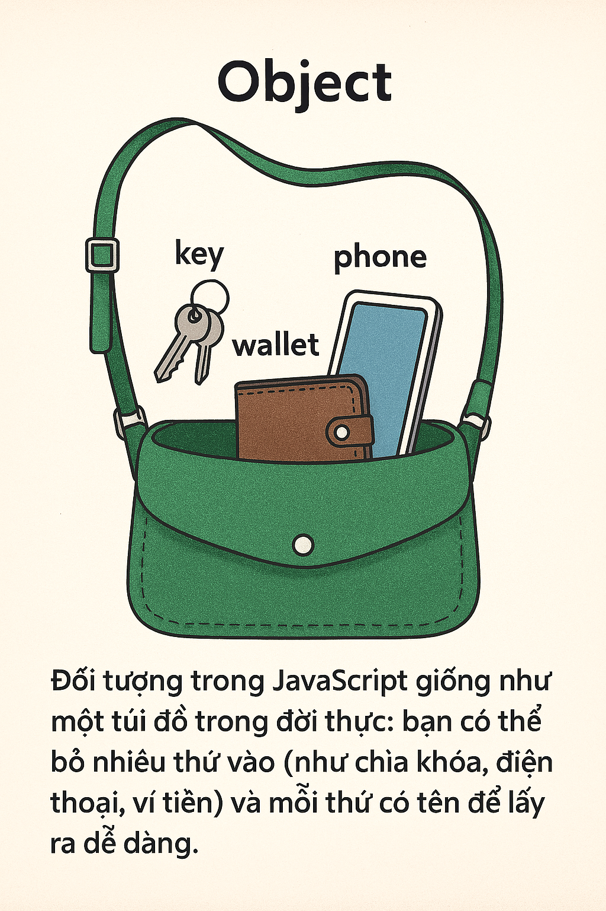

Đối tượng trong JavaScript giống như một **túi đồ** trong đời thực: bạn có thể bỏ nhiều thứ vào (như chìa khóa, điện thoại, ví tiền) và mỗi thứ có tên để lấy ra dễ dàng.



---

## 1. Đối tượng là gì?

Hãy nghĩ về đối tượng như một **túi đồ** hoặc một **hộp quà**. Trong hộp, bạn có thể để nhiều thứ: một cây bút (gọi là "bút"), một cuốn sổ (gọi là "sổ"), và mỗi thứ có thể lấy ra bằng tên. Đối tượng trong JavaScript cũng vậy: nó chứa nhiều **thuộc tính** (như bút, sổ) và mỗi thuộc tính có **tên** và **giá trị**.

**Giải thích đơn giản**:

- Đối tượng là một **bộ sưu tập** các cặp **tên: giá trị** (key-value).
- **Tên** (key): Thường là chuỗi (như "ten", "tuoi").
- **Giá trị** (value): Có thể là số, chuỗi, mảng, hàm, hoặc thậm chí một đối tượng khác.
- Dùng để nhóm dữ liệu liên quan, như thông tin một người (tên, tuổi, địa chỉ).

**Ví dụ đời thường**: Một học sinh có thông tin: tên là "Tèo", tuổi là 15, lớp là "10A". Thay vì lưu riêng lẻ, bạn bỏ tất cả vào một "túi" gọi là đối tượng.

**Ví dụ code**:

```javascript
let hocSinh = {
  ten: "Tèo",
  tuoi: 15,
  lop: "10A",
};
console.log(hocSinh.ten); // In: Tèo
```

---

## 2. Tại sao sử dụng đối tượng?

Thay vì để bút, sổ, điện thoại lung tung trên bàn, bạn bỏ vào một túi để dễ quản lý. Đối tượng giúp bạn tổ chức dữ liệu gọn gàng.

**Giải thích đơn giản**:

- **Nhóm dữ liệu**: Gộp các thông tin liên quan (như tên, tuổi) vào một chỗ.
- **Dễ đọc, dễ sửa**: Thay vì dùng nhiều biến riêng lẻ, bạn chỉ cần một đối tượng.
- **Linh hoạt**: Đối tượng có thể chứa cả dữ liệu (thuộc tính) và hành động (phương thức).
- **Tái sử dụng**: Dùng đối tượng để mô tả nhiều thứ giống nhau (như nhiều học sinh).

**Ví dụ đời thường**: Trong game, một nhân vật có máu, sức mạnh, vũ khí. Đối tượng giúp bạn lưu tất cả thông tin này trong một "túi" để dễ quản lý.

**Ví dụ code**:

```javascript
// Không dùng đối tượng (lộn xộn)
let ten1 = "Tèo";
let tuoi1 = 15;
let lop1 = "10A";
let ten2 = "Tý";
let tuoi2 = 16;
let lop2 = "11B";

// Dùng đối tượng (gọn gàng)
let hocSinh1 = { ten: "Tèo", tuoi: 15, lop: "10A" };
let hocSinh2 = { ten: "Tý", tuoi: 16, lop: "11B" };
console.log(hocSinh1.ten); // In: Tèo
console.log(hocSinh2.ten); // In: Tý
```

---

## 3. Cách tạo đối tượng

Tạo đối tượng giống như làm một túi đồ mới, bạn quyết định bỏ gì vào và đặt tên cho từng món.

**Giải thích đơn giản**:

- Có nhiều cách tạo đối tượng:
  1. **Object literal** (dùng `{}`): Cách đơn giản nhất.
  2. **Hàm tạo** (constructor function): Tạo nhiều đối tượng giống nhau.
  3. **Từ khóa `new Object`**: Ít dùng nhưng linh hoạt.
  4. **Class** (ES6): Cách hiện đại để tạo đối tượng.

**Ví dụ code**:

```javascript
// Cách 1: Object literal
let hocSinh = {
  ten: "Tèo",
  tuoi: 15,
  lop: "10A",
};

// Cách 2: Hàm tạo
function HocSinh(ten, tuoi, lop) {
  this.ten = ten;
  this.tuoi = tuoi;
  this.lop = lop;
}
let hocSinh1 = new HocSinh("Tý", 16, "11B");

// Cách 3: new Object
let hocSinh2 = new Object();
hocSinh2.ten = "Mai";
hocSinh2.tuoi = 14;
hocSinh2.lop = "9C";

// Cách 4: Class (ES6)
class HocSinhClass {
  constructor(ten, tuoi, lop) {
    this.ten = ten;
    this.tuoi = tuoi;
    this.lop = lop;
  }
}
let hocSinh3 = new HocSinhClass("Lan", 15, "10B");

console.log(hocSinh.ten); // In: Tèo
console.log(hocSinh1.ten); // In: Tý
console.log(hocSinh2.ten); // In: Mai
console.log(hocSinh3.ten); // In: Lan
```

---

## 4. Truy cập và sửa đổi thuộc tính

Bạn mở túi đồ, lấy cây bút ra (truy cập) hoặc bỏ thêm một cuốn sổ vào (sửa đổi). Với đối tượng, bạn dùng tên thuộc tính để lấy hoặc thay đổi giá trị.

**Giải thích đơn giản**:

- Truy cập bằng:
  - **Dấu chấm** (`.ten`): Dùng khi biết tên thuộc tính.
  - **Dấu ngoặc** (`["ten"]`): Dùng khi tên thuộc tính là biến hoặc có ký tự đặc biệt.
- Sửa đổi: Gán giá trị mới hoặc thêm thuộc tính mới.

**Ví dụ code**:

```javascript
let hocSinh = { ten: "Tèo", tuoi: 15, lop: "10A" };

// Truy cập
console.log(hocSinh.ten); // In: Tèo
console.log(hocSinh["lop"]); // In: 10A

// Sửa đổi
hocSinh.tuoi = 16; // Cập nhật tuổi
hocSinh.diem = 8.5; // Thêm thuộc tính mới
console.log(hocSinh); // In: { ten: "Tèo", tuoi: 16, lop: "10A", diem: 8.5 }
```

---

## 5. Phương thức trong đối tượng

Trong túi đồ, ngoài bút và sổ, bạn có thể bỏ vào một **máy tính nhỏ** để tính toán. Phương thức là hàm bên trong đối tượng, giúp đối tượng thực hiện hành động.

**Giải thích đơn giản**:

- Phương thức là **hàm** được gán vào thuộc tính của đối tượng.
- Dùng để mô tả hành vi của đối tượng, như in thông tin, tính toán.

**Ví dụ code**:

```javascript
let hocSinh = {
  ten: "Tèo",
  tuoi: 15,
  lop: "10A",
  gioiThieu: function () {
    return `Tôi là ${this.ten}, học lớp ${this.lop}`;
  },
};
console.log(hocSinh.gioiThieu()); // In: Tôi là Tèo, học lớp 10A
```

---

## 6. Vòng lặp qua đối tượng

Bạn mở túi đồ và kiểm tra từng món bên trong. Vòng lặp qua đối tượng giống như xem từng thuộc tính để biết giá trị.

**Giải thích đơn giản**:

- Dùng `for...in` để lặp qua các thuộc tính của đối tượng.
- Hoặc dùng `Object.keys()`, `Object.values()`, `Object.entries()` để lấy danh sách thuộc tính/giá trị.

**Ví dụ code**:

```javascript
let hocSinh = { ten: "Tèo", tuoi: 15, lop: "10A" };

// Dùng for...in
for (let key in hocSinh) {
  console.log(`${key}: ${hocSinh[key]}`);
}
// In:
// ten: Tèo
// tuoi: 15
// lop: 10A

// Dùng Object.entries
console.log(Object.entries(hocSinh));
// In: [["ten", "Tèo"], ["tuoi", 15], ["lop", "10A"]]
```

---

## 7. Sao chép đối tượng

Bạn muốn tạo một túi đồ giống hệt túi cũ, nhưng nếu chỉ trỏ vào túi cũ, thay đổi túi mới sẽ làm hỏng túi cũ. Sao chép đối tượng cần cẩn thận để tránh điều này.

**Giải thích đơn giản**:

- Sao chép **nông** (shallow copy): Chỉ sao chép thuộc tính cấp đầu, thuộc tính lồng nhau (như mảng, đối tượng) vẫn liên kết.
- Sao chép **sâu** (deep copy): Sao chép toàn bộ, kể cả thuộc tính lồng nhau.

**Ví dụ code**:

```javascript
let hocSinh = { ten: "Tèo", tuoi: 15, diem: [8, 9] };

// Shallow copy
let copy1 = { ...hocSinh };
copy1.diem[0] = 7; // Ảnh hưởng cả hocSinh
console.log(hocSinh.diem); // In: [7, 9]

// Deep copy (dùng JSON)
let copy2 = JSON.parse(JSON.stringify(hocSinh));
copy2.diem[0] = 6; // Không ảnh hưởng hocSinh
console.log(hocSinh.diem); // In: [7, 9]
```

---

## 8. Từ khóa `this`

Trong túi đồ, bạn có một ghi chú nói "Tên của túi này là Tèo". `this` giống ghi chú đó: nó trỏ đến chính đối tượng đang sử dụng.

**Giải thích đơn giản**:

- `this` là cách đối tượng tự tham chiếu đến chính nó.
- Thường dùng trong phương thức để truy cập thuộc tính của đối tượng.

**Ví dụ code**:

```javascript
let hocSinh = {
  ten: "Tèo",
  gioiThieu: function () {
    return `Tôi là ${this.ten}`;
  },
};
console.log(hocSinh.gioiThieu()); // In: Tôi là Tèo
```

---

## 9. Prototype

Bạn có một túi đồ cơ bản (như bút, sổ). Bạn muốn tạo nhiều túi khác, nhưng mỗi túi có thêm món đặc biệt (như máy tính, thước kẻ). **Prototype** giống như một "bản thiết kế chung" mà các túi khác có thể dùng.

**Giải thích đơn giản**:

- Mọi đối tượng có một **prototype** (bản thiết kế ẩn) chứa các thuộc tính/phương thức chung.
- Kế thừa: Đối tượng có thể dùng thuộc tính/phương thức từ prototype.
- Dùng để chia sẻ hành vi giữa nhiều đối tượng.

**Ví dụ code**:

```javascript
function HocSinh(ten, tuoi) {
  this.ten = ten;
  this.tuoi = tuoi;
}
HocSinh.prototype.gioiThieu = function () {
  return `Tôi là ${this.ten}, ${this.tuoi} tuổi`;
};

let hs1 = new HocSinh("Tèo", 15);
let hs2 = new HocSinh("Tý", 16);
console.log(hs1.gioiThieu()); // In: Tôi là Tèo, 15 tuổi
console.log(hs2.gioiThieu()); // In: Tôi là Tý, 16 tuổi
```

---

## 10. JSON và đối tượng

JSON giống như cách bạn viết danh sách đồ trong túi ra giấy để gửi cho bạn bè. Đối tượng có thể chuyển thành JSON và ngược lại.

**Giải thích đơn giản**:

- **JSON** (JavaScript Object Notation) là định dạng chuỗi để biểu diễn đối tượng.
- Dùng `JSON.stringify()` để biến đối tượng thành chuỗi.
- Dùng `JSON.parse()` để biến chuỗi thành đối tượng.

**Ví dụ code**:

```javascript
let hocSinh = { ten: "Tèo", tuoi: 15 };
let jsonStr = JSON.stringify(hocSinh);
console.log(jsonStr); // In: {"ten":"Tèo","tuoi":15}

let obj = JSON.parse(jsonStr);
console.log(obj.ten); // In: Tèo
```

---

## Kết luận và mẹo sử dụng

- **Đối tượng** giúp tổ chức dữ liệu gọn gàng, như một túi đồ chứa nhiều thông tin liên quan.
- Dùng **phương thức** để thêm hành vi, **prototype** để chia sẻ hành vi.
- **Sao chép sâu** khi cần tách biệt đối tượng.
- **Mẹo**:
  - Đặt tên thuộc tính rõ ràng (như `ten` thay vì `t`).
  - Hạn chế thuộc tính lồng sâu để dễ quản lý.
  - Kiểm tra thuộc tính trước khi truy cập (`if (obj.ten) ...`).
  - Dùng class (ES6) cho các dự án lớn, dễ bảo trì.

**Flowchart tổng thể**:

```
[ Dữ liệu ] --> Đối tượng { ten, tuoi, lop }
                   |
                   |--> Thuộc tính (truy cập: .ten, ["ten"])
                   |--> Phương thức (hành vi: gioiThieu())
                   |--> Prototype (chia sẻ: HocSinh.prototype.gioiThieu)
                   |--> JSON (chuyển đổi: JSON.stringify, JSON.parse)
```

---

## Tài liệu tham khảo

- [MDN Web Docs: Objects](https://developer.mozilla.org/en-US/docs/Web/JavaScript/Guide/Working_with_Objects)
- [Eloquent JavaScript: Data Structures](https://eloquentjavascript.net/04_data.html)
- [JavaScript.info: Objects](https://javascript.info/object)
