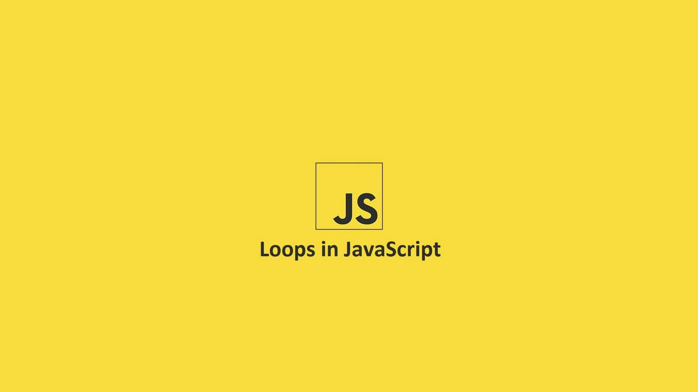
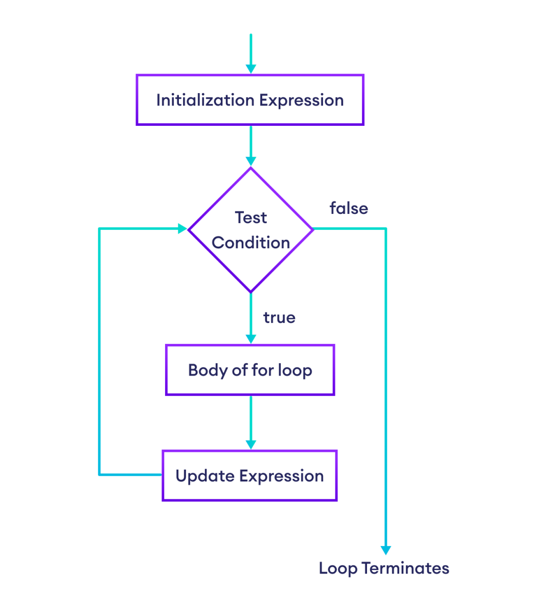
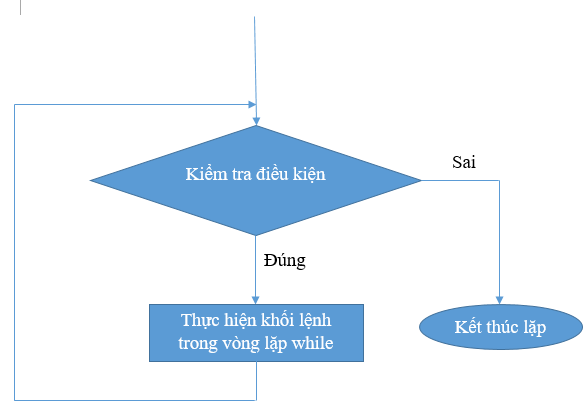
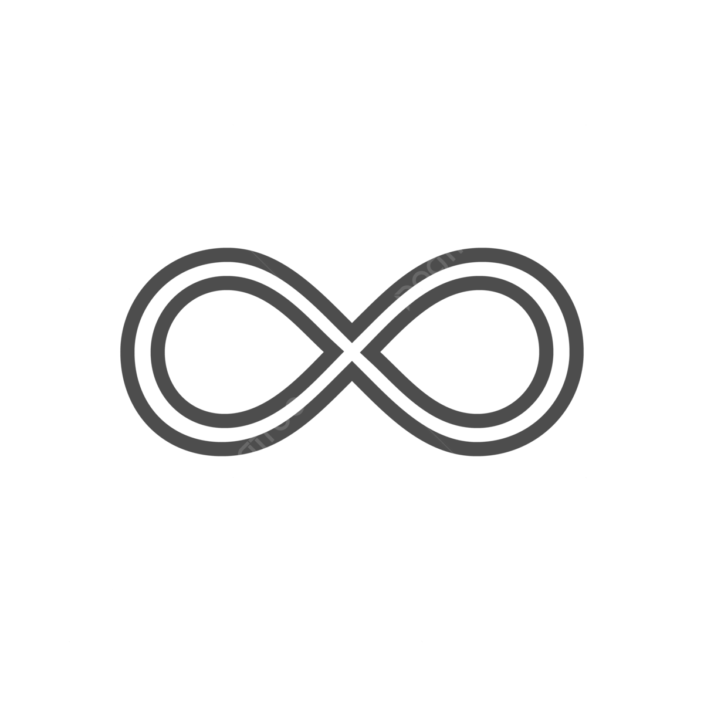

**Mục tiêu:** chương này trình bày chi tiết mọi loại vòng lặp trong JavaScript, ví dụ thực tế, anti-patterns, so sánh, hiệu suất, các lỗi thường gặp và bài tập có lời giải.

---

## 1. Giới thiệu chung

Vòng lặp (loop) là cấu trúc cho phép thực thi một khối mã nhiều lần. Vòng lặp khác nhau ở:

- **khi nào kiểm tra điều kiện** (đầu/ cuối)
- **đối tượng để lặp** (số lần, mảng, object, iterable)
- **khả năng thoát sớm** (break), bỏ qua (continue)
- **tương tác với async/await**

Trong JavaScript phổ biến: `while`, `do...while`, `for`, `for...of`, `for...in`, và các phương thức mảng (`forEach`, `map`, `filter`, `reduce`, ...).



## 2. while



### 2.1 Cú pháp

```js
while (condition) {
  // body
}
```

### 2.2 Nguyên lý

- Kiểm tra `condition` điều kiện trước mỗi lần lặp.
- Nếu `true` → chạy body → quay lại kiểm tra.
- Nếu `false` → không chạy body lần nào (nếu ban đầu false).

### 2.3 Ví dụ cơ bản

```js
let i = 0;
while (i < 5) {
  console.log(i);
  i++;
}
```

### 2.4 Ví dụ thực tế: poll một trạng thái

Giả sử ta muốn chờ giá trị `ready` trở thành `true` (ví dụ demo; thực tế dùng event thay vì poll):

```js
async function waitForReady(checkFn, interval = 500, timeout = 5000) {
  const start = Date.now();
  while (Date.now() - start < timeout) {
    const ok = await checkFn();
    if (ok) return true;
    await new Promise((r) => setTimeout(r, interval));
  }
  return false;
}
```

### 5.5 Pitfall — vòng vô hạn



```js
let i = 0;
while (i < 3) {
  console.log(i);
  // missing i++ => infinite loop
}
```

**Cách debug:** thêm `console.log`, breakpoint; đảm bảo biến thay đổi. Tránh `while(true)` **không** có **break** trừ khi cần thiết (server loops).

### Pattern: sentinel loop

Khi đầu vào kết thúc bởi "sentinel" (ví dụ: nhập -1 để dừng):

```js
let n;
while ((n = Number(prompt("Nhập số (-1 để kết thúc)"))) !== -1) {
  console.log("Bạn nhập", n);
}
```

---

## 3. do...while

### 3.1 Cú pháp

```js
do {
  // body
} while (condition);
```

### 3.2 Điểm nổi bật

- Body chạy **ít nhất 1 lần**, sau đó mới kiểm tra `condition`.
- Dùng cho menu hoặc nhập dữ liệu cần chạy trước, kiểm tra sau.

### 3.3 Ví dụ

```js
let answer;
do {
  answer = prompt("Tiếp tục? (yes/no)");
} while (answer !== "no");
```

---

## 4. for (cổ điển)

### 4.1 Cú pháp tiêu chuẩn

```js
for (initialization; condition; finalExpression) {
  // body
}
```

- `initialization` chạy một lần.
- `condition` kiểm tra trước mỗi lần lặp.
- `finalExpression` chạy sau mỗi body (thường tăng biến đếm).

### 4.2 Ví dụ

```js
for (let i = 0; i < 5; i++) console.log(i);
```

### 4.3 Và nhiều biến cùng lúc

```js
for (let i = 0, len = arr.length; i < len; i++) { ... }
```

### 4.4 Hoisting / scope: var vs let

```js
for (var i = 0; i < 3; i++) {}
console.log(i); // 3 (var là function-scoped)

for (let j = 0; j < 3; j++) {}
console.log(typeof j); // undefined (j không tồn tại ngoài block)
```

**Lời khuyên:** luôn dùng `let`/`const`(for ... of) trong vòng lặp.

### 4.5 Closure trong loop (bẫy phổ biến)

```js
for (var i = 0; i < 3; i++) {
  setTimeout(() => console.log(i), 100);
}
// Kết quả: 3,3,3 (vì var i dùng chung sau vòng lập i = 3)

// Fix 1: dùng let
for (let i = 0; i < 3; i++) {
  setTimeout(() => console.log(i), 100); // 0,1,2
}

// Fix 2: IIFE
for (var i = 0; i < 3; i++) {
  // Mỗi vòng lặp sẽ tạo ra một hàm mới.
  // Tham số (i) truyền vào là bản sao của giá trị i ở vòng đó.
  (function (i) {
    setTimeout(() => console.log(i), 100);
  })(i);

  // => Mỗi hàm IIFE có biến i riêng biệt trong scope riêng của nó.
}
```

### 4.6 Ví dụ: vòng lặp lồng nhau (matrix)

```js
const mat = [
  [1, 2, 3],
  [4, 5, 6],
  [7, 8, 9],
];

for (let i = 0; i < mat.length; i++) {
  for (let j = 0; j < mat[i].length; j++) {
    console.log(i, j, mat[i][j]);
  }
}
```

---

## 5. for...of

### 5.1 Cú pháp

```js
for (const val of iterable) {
  // val is each value
}
```

### 5.2 Iterable? (các đối tượng support)

- Array, String, Map, Set, NodeList, arguments, các object có Symbol.iterator

### 5.3 Ví dụ

```js
for (const ch of "abc") console.log(ch);
// a b c

const s = new Set([1, 2, 3]);
for (const v of s) console.log(v);
```

### 5.4 for...of vs forEach vs for (classic)

- `for...of` hỗ trợ `break`, `continue` và `await` (tuần tự) — rất phù hợp để gọi async tuần tự.

```js
for (const item of [1, 2, 3]) {
  if (item === 2) continue;
  console.log(item); // 1, 3
}
```

- `forEach` **không** dừng bằng `break` (không hỗ trợ await tuần tự).

```js
[1, 2, 3].forEach((item) => console.log(item));
```

- `for` cổ điển phù hợp khi cần index hoặc nâng cấp hiệu năng vi mô.

```js
for (let i = 0; i < 3; i++) {
  console.log(i);
}
```

### 5.5 Destructuring với for...of (Map entries)

```js
const m = new Map([
  ["a", 1],
  ["b", 2],
]);
for (const [k, v] of m) {
  console.log(k, v);
}
```

---

## 6. for...in

### 6.1 Cú pháp

```js
for (const key in object) {
  // key is property name (string)
}
```

### 6.2 Dùng để lặp **thuộc tính** của object (không dùng cho mảng)

```js
const user = { name: "Alice", age: 30 };
for (const k in user) {
  if (user.hasOwnProperty(k)) {
    console.log(k, user[k]);
  }
}
```

### 6.3 Cảnh báo

- `for...in` lặp cả thuộc tính trên prototype chain. Dùng kèm `hasOwnProperty` nếu cần.
- Thứ tự không được đảm bảo (với object). Với mảng, dùng `for` hoặc `for...of`.

---

## 7. Các phương thức lặp của mảng (functional)

Các phương thức này không phải là 'vòng lặp' cú pháp, nhưng thực hiện lặp nội bộ.

### 7.1 arr.forEach(fn)

- Chạy `fn(value, index, array)` cho từng phần tử.
- Trả về `undefined` (không chain được result).
- Không hỗ trợ `break` / `continue`. Có thể `return` ra khỏi callback nhưng không thoát vòng lặp ngoài.

```js
[1, 2, 3].forEach((v, i) => console.log(i, v));
```

### 7.2 arr.map(fn)

- Trả về mảng mới: `result[i] = fn(array[i])`.
- Dùng khi cần chuyển đổi mảng.

```js
const doubled = [1, 2, 3].map((x) => x * 2); // [2,4,6]
```

### 7.3 arr.filter(fn)

- Trả về mảng gồm phần tử thỏa điều kiện `fn` (true).

```js
const evens = [1, 2, 3, 4].filter((x) => x % 2 === 0); // [2,4]
```

### 7.4 arr.reduce(fn, init)

- Dùng để gộp mảng thành 1 giá trị (accumulator).

```js
const sum = [1, 2, 3].reduce((acc, v) => acc + v, 0);
```

### 7.5 arr.find / findIndex / some / every

- `find` trả về phần tử đầu tiên thỏa điều kiện.
- `findIndex` trả về index của phần tử đầu tiên thỏa điều kiện.
- `some` trả về `true` nếu _bất kỳ_ phần tử thỏa điều kiện.
- `every` trả về `true` nếu _tất cả_ phần tử thỏa điều kiện.

### 7.6 flatMap (ES2019)

- Map từng phần tử và "phẳng hóa" kết quả 1 mức.

### 7.7 Lưu ý async & forEach/map

- `arr.forEach(async x => { await ... })` sẽ không tuần tự (outer function won't await the inner promises). Dùng `for...of` + `await` nếu cần tuần tự.

---

## 8. break / continue / label

### 8.1 break

- Thoát hoàn toàn vòng lặp hiện tại.

```js
for (let i = 0; i < 10; i++) {
  if (i === 4) break;
  console.log(i);
}
```

### 8.2 continue

- Bỏ phần còn lại trong lần lặp, chuyển sang lần tiếp theo.

```js
for (let i = 0; i < 5; i++) {
  if (i % 2 === 0) continue;
  console.log(i);
}
```

### 8.3 Labeled break / continue (khi dùng nested loops)

```js
outer: for (let i = 0; i < 3; i++) {
  for (let j = 0; j < 3; j++) {
    if (i === 1 && j === 1) break outer;
    console.log(i, j);
  }
}
// Kết quả:
// 0 0
// 0 1
// 0 2
// 1 0
```

**Cẩn trọng**: labelled break/continue làm code khó đọc; chỉ dùng khi thực sự cần.

---

## 9. Vòng lặp lồng nhau & tối ưu hóa

### 9.1 Tính phức tạp thời gian

- Nested loops thường O(n\*m) hoặc O(n^2) nếu hai chiều tương tự.
- Ví dụ: loop lồng nhau kiểm tra cặp phần tử → O(n^2).

### 9.2 Ví dụ — tìm cặp có tổng k (O(n^2))

```js
const arr = [1, 2, 3, 4, 5];
const k = 7;
for (let i = 0; i < arr.length; i++) {
  for (let j = i + 1; j < arr.length; j++) {
    if (arr[i] + arr[j] === k) {
      console.log("Found", arr[i], arr[j]);
    }
  }
}
```

### 9.3 Tối ưu: dùng bộ nhớ (hash) để giảm xuống O(n)

```js
const seen = new Set();
for (const v of arr) {
  const need = k - v;
  if (seen.has(need)) {
    console.log("Found", v, need);
    break;
  }
  seen.add(v);
}
```

### 9.4 Lồng nhiều cấp (3+): cân nhắc thuật toán khác (divide and conquer, sort & two-pointer, k-sum optimized)

---

## 10. Xóa / Chỉnh sửa phần tử khi lặp

Các cách phổ biến và an toàn:

### 10.1 Lặp từ cuối về đầu (splice an toàn)

```js
for (let i = arr.length - 1; i >= 0; i--) {
  if (arr[i] < threshold) arr.splice(i, 1);
}
```

### 10.2 Dùng filter để tạo mảng mới (immutable style)

```js
arr = arr.filter((x) => x >= threshold);
```

### 10.3 Lưu index cần xóa rồi xóa sau (khi muốn mark-first)

```js
const toRemove = [];
for (let i = 0; i < arr.length; i++) {
  if (shouldRemove(arr[i])) toRemove.push(i);
}
for (let idx of toRemove.reverse()) arr.splice(idx, 1);
```

### 10.4 Tránh dùng shift() trong vòng lặp lớn

`shift()` di chuyển toàn bộ mảng (O(n)), gây chậm nếu lặp nhiều lần.

---

## 11. Async trong vòng lặp: tuần tự vs song song

### 11.1 Vấn đề thường gặp

- Dùng `forEach` với `async` không chờ await tuần tự.

```js
urls.forEach(async (url) => {
  const res = await fetch(url); //  sẽ không chờ ở ngoài
});
console.log("Xong!");
// In ra "Xong!" ngay lập tức, dù các fetch() còn đang chạy.
```

### 11.2 Thực thi tuần tự (order important)

Chờ hoàn thành toàn bộ bước hiện tại rồi mới tiếp tục sang bước kế tiếp.

```js
const urls = ["https://example.com/file1.txt", "https://example.com/file2.txt"];

for (const url of urls) {
  const res = await fetch(url);
  console.log(await res.text());
}
console.log("Tất cả đã xong!");

// Nội dung file1.txt
// Nội dung file2.txt
// Tất cả đã xong!
```

### 11.3 Thực thi song song (tất cả cùng lúc, chờ tất cả)

```js
const urls = [
  "https://example.com/a.txt",
  "https://example.com/b.txt",
  "https://example.com/c.txt",
];

const promises = urls.map((url) => fetch(url));
const results = await Promise.all(promises);

for (const res of results) {
  console.log(await res.text());
}

// Nội dung file A
// Nội dung file B
// Nội dung file C

// => Tất cả request đều chạy song song → nhanh hơn nhiều so với for...of + await.
```

---

## 12. Generators / Iterators (nhắc qua)

Generators (function\*) tạo iterator, cung cấp cách lazy iterate, hữu ích khi data lớn hoặc stream-like:

```js
function* idGen() {
  let id = 1;
  while (true) yield id++;
}
const g = idGen();
console.log(g.next().value); // 1
console.log(g.next().value); // 2
```

---

## 13. Tóm tắt nhanh

## Tổng hợp các loại vòng lặp trong JavaScript

| Loại vòng lặp                               | Đặc điểm chính                                                                  | Khi nên dùng                                                |
| ------------------------------------------- | ------------------------------------------------------------------------------- | ----------------------------------------------------------- |
| **`while`**                                 | Kiểm tra điều kiện **trước khi chạy** (`check-first`)                           | Khi chưa biết trước số lần lặp                              |
| **`do...while`**                            | Chạy **ít nhất 1 lần** rồi mới kiểm tra (`run-first`)                           | Khi cần thực thi ít nhất 1 lần                              |
| **`for`**                                   | Dựa trên **chỉ số (index)**                                                     | Khi cần kiểm soát số vòng hoặc truy cập mảng theo chỉ số    |
| **`for...of`**                              | Duyệt **giá trị** của iterable (array, string, map, set)                        | Khi cần đọc giá trị, hỗ trợ `await`, `break`, `continue`    |
| **`for...in`**                              | Duyệt **key** của object                                                        | Khi cần duyệt thuộc tính (nhớ dùng `hasOwnProperty`)        |
| **`forEach` / `map` / `filter` / `reduce`** | Cú pháp **hàm bậc cao (functional)**                                            | Khi cần viết ngắn gọn, dễ đọc; không dừng được bằng `break` |
| **Xóa phần tử**                             | Lặp ngược (`for (let i = arr.length - 1; i >= 0; i--)`) hoặc dùng `filter()`    | Để tránh lỗi khi thay đổi mảng khi đang lặp                 |
| **Bất đồng bộ (async)**                     | `for...of` + `await` → chạy **tuần tự**<br>`Promise.all()` → chạy **song song** | Chọn tùy mục đích: cần thứ tự hay tốc độ                    |

---

## Ghi nhớ nhanh:

> `while` – kiểm tra trước  
> `do...while` – chạy trước rồi kiểm tra  
> `for` – theo chỉ số  
> `for...of` – theo giá trị  
> `for...in` – theo key  
> `forEach` – không dừng/await được  
> `async` – tuần tự (`for...of`), song song (`Promise.all`)
